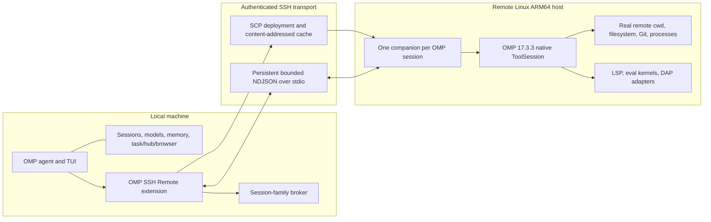

# OMP SSH Remote

[简体中文](README.zh-CN.md) | English

OMP SSH Remote keeps the Oh My Pi (OMP) control plane on your local machine while executing native workspace tools inside a persistent companion process on a remote host over SSH.

The local process retains the TUI, conversations, sessions, model credentials, Magic Context, and control-plane tools. Remote companions operate on the remote host's real filesystem, processes, dependencies, Git checkout, language servers, eval kernels, and debugger adapters.

> [!IMPORTANT]
> This repository is currently a Git source preview, pinned to OMP `17.3.3`, protocol version `1`, and worker runtime `0.3.0`. Installation means cloning this repository, building it locally, and linking that checkout into OMP. Prebuilt releases, npm publication, and registry-based plugin installation are not provided yet.

## Why This Exists

A remote workspace is more than `ssh host command`. OMP's file editing, hashline snapshots, AST proposals, LSP clients, eval kernels, and debugger sessions keep state across calls. Running those native tools in one remote companion preserves their behavior and keeps every workspace operation in one remote path and process domain.

This approach avoids:

- mounting a remote filesystem under a different local path;
- reimplementing every OMP tool as an SSH or SFTP wrapper;
- running a complete remote OMP agent with model credentials and conversation state;
- silently falling back to local files after a remote connection fails.

## Before You Start

The current Git installation is usable when all of the following are true:

- OMP runs on a Linux or WSL machine and is exactly version `17.3.3`;
- the local build machine can run Bun `1.3+`, Git, npm, tar, SSH, and SCP;
- the remote host is glibc Linux `aarch64`;
- public-key SSH already works without an interactive password prompt;
- the project already exists at an absolute path on the remote host.

The local build machine does **not** need to be ARM64. Linux x64 and x64 WSL can cross-compile the ARM64 companion. The remote host does not need Bun or OMP.

If these conditions do not match your environment, do not bypass version or SSH security checks. Additional platform builds and prebuilt installation are roadmap items.

All hostnames, usernames, paths, ports, and key filenames in this README are placeholders. Replace them with your own values.

## Architecture



### Execution model

1. `/remote-connect` probes the remote platform and home directory through SSH.
2. The extension finds the locally built Linux ARM64 companion and reads its SHA-256 sidecar.
3. On a cache miss, SCP uploads the companion to `~/.cache/omp-ssh-remote/<omp-version>/<sha256>/worker`, verifies its hash, and atomically activates it.
4. One persistent SSH stdio channel carries initialization, tool calls, partial updates, cancellation, results, and shutdown.
5. The remote worker invokes OMP's native tool implementations in the requested remote working directory.
6. On disconnect or protocol failure, selected workspace tools fail closed. They never run against the local workspace by accident.

### Session and subagent isolation

A parent OMP session and each ordinary non-isolated child session receive independent remote companions. They share only the SSH ControlMaster and cached binary. Their edit snapshots, AST proposals, eval kernels, and debugger sessions do not share state.

OMP session switching, branching, forking, and handoff are blocked while remote mode is selected. Disconnect first with `/remote-exit`.

### Terms used in this README

- **Control plane:** the local OMP process that owns the conversation, model access, credentials, memory, and orchestration.
- **Companion:** the minimal remote process that executes native OMP workspace tools without running a model or agent loop.
- **Fail closed:** after a remote failure, a workspace call returns an error instead of silently running against local files.
- **Content-addressed cache:** a remote worker directory selected by the binary's SHA-256, so an identical build is uploaded only once.
- **Session family:** one parent OMP session and its ordinary non-isolated child sessions. Each member gets an independent companion.
- **LSP / DAP:** language-server and debugger protocols. Project-specific servers and adapters must be installed on the remote host.
- **Hashline / AST proposal:** OMP's stateful file-edit and syntax-edit workflows. Their state stays inside the companion that created it.

## Tool Routing

Only tools already active in the host OMP session are shadowed. The extension does not expose tools disabled by the user's OMP configuration.

| Destination              | Capabilities                                                                                                                                    |
| ------------------------ | ----------------------------------------------------------------------------------------------------------------------------------------------- |
| Remote native runtime    | `read`, `write`, `edit`, `bash`, `grep`, `glob`, `lsp`, `ast_grep`, `ast_edit`, `eval`, `debug`                                                 |
| Local control plane      | TUI, sessions, model calls, credentials, Magic Context, memory, `ask`, `task`, `hub`, `todo`, browser/computer tools, web search, security scan |
| Local internal resources | URI-backed resources such as `skill://`, `agent://`, `history://`, `artifact://`, `memory://`, and `local://`                                   |

Routing rules:

- ordinary relative and absolute filesystem paths execute remotely;
- any `scheme://` URI stays local;
- a single tool call cannot mix local URI resources and remote filesystem paths;
- native LSP and AST tools retain the host's top-level or `xd://` call surface;
- an `ast_edit` proposal and its later resolve or reject action always return to the same `ToolSession`;
- remote eval exposes only constrained remote workspace helpers, not local control-plane tools.

### Agent workspace status

`remote_workspace_status` is a zero-argument, read-only tool available to the agent. It reports the extension's current known state without a network request:

- `local`: ordinary filesystem paths use local native tools;
- `remote`: ordinary filesystem paths use the named remote cwd and native remote tools;
- `unavailable`: remote mode remains selected, but ordinary filesystem paths are rejected rather than falling back locally.

The result also lists the currently wrapped remote tools, the session role, pending remote AST proposals, and the fixed local boundary for URI resources and control-plane tools. The agent can call it when execution location is unclear, after a remote error, or when asked where a tool will run. It is not called automatically and does not ping SSH; `/remote-status` remains the user-facing view of the current known transport state.

## Current Support

### Verified

- Local OMP: `17.3.3`.
- Local build environment: Linux or WSL with Bun `1.3` or newer.
- Remote worker: glibc Linux `aarch64`.
- Remote host requires SSH access but does not require Bun, npm, or OMP.
- Foreground Bash streaming and cancellation.
- Persistent hashline editing, AST proposal resolution, LSP, Python/JavaScript eval state, and DAP debug sessions.
- Ordinary non-isolated `task` children with independent companion state.

### Not yet supported

- macOS, Windows, Linux x64, or musl remote workers;
- prebuilt GitHub Release assets or npm installation;
- `bash async:true` and automatic background jobs;
- `task isolated:true` remote worktrees;
- remote artifact transfer into the local artifact store;
- outputs larger than the 16 MiB protocol-frame limit;
- remote eval model calls, subagents, recursive eval, or nested stateful `ast_edit` proposals.

## Installation From Source

### 1. Prerequisites

On the machine where OMP runs locally, install:

- OMP exactly `17.3.3`;
- Bun `1.3` or newer;
- Git;
- npm;
- tar;
- OpenSSH client and SCP.

If OMP is not already installed, install the exact supported release with Bun:

```bash
bun install -g @oh-my-pi/pi-coding-agent@17.3.3
```

Check the versions:

```bash
omp --version
bun --version
git --version
npm --version
ssh -V
command -v scp
tar --version
```

`omp --version` must report `omp/17.3.3`. The protocol handshake rejects other OMP versions rather than risking schema drift.

The build downloads the official version-matched Linux ARM64 native addon from npm and produces a self-contained companion of roughly 134 MiB. Linux x64 and x64 WSL are supported build machines because Bun cross-compiles the ARM64 executable. The build machine needs npm registry access and enough temporary disk space for the native package and output binary.

### 2. Clone the Git repository

On the repository's GitHub page, choose **Code → HTTPS**, copy the displayed URL, and run:

```bash
git clone <copied-repository-url> omp-ssh-remote
cd omp-ssh-remote
```

Replace `<copied-repository-url>` with the URL copied from GitHub; do not type the angle brackets literally. If you do not use Git on the command line, choose **Code → Download ZIP**, extract it, and open a terminal in the extracted `omp-ssh-remote` directory. ZIP installations work, but cannot use `git pull` for updates.

### 3. Install dependencies and build

```bash
bun install --frozen-lockfile
bun run check
bun run build:worker:arm64
```

Expected outputs include:

```text
dist/extension.js
dist/worker.js
dist/worker-linux-arm64
dist/worker-linux-arm64.sha256
```

`bun run check` performs the TypeScript check, builds the extension and development worker separately, and runs local behavior tests; it does not connect to a remote server. Do not continue if it fails. `build:worker:arm64` creates the self-contained remote binary.

### 4. Link the Git checkout into OMP

Run this from the repository root, the directory that contains `package.json`. Do not link `dist/`:

```bash
omp plugin link "$PWD"
omp plugin list
```

`plugin link` does not download or copy the project. It creates an OMP plugin link to this checkout, so keep the repository directory in place. `omp plugin list` should show `omp-ssh-remote` version `0.7.0`.

Exit every running OMP process and start OMP again. Inside the restarted OMP session, run:

```text
/remote-status
```

Before connecting, the expected status is:

```text
Remote runtime: disconnected (local tools active)
```

If `/remote-status` is unknown, see [Troubleshooting](#troubleshooting).

## Prepare the Remote Host

### 1. Verify the remote platform

The current bundled worker requires Linux `aarch64`:

```bash
ssh developer@remote.example.com 'uname -s; uname -m'
```

Expected output:

```text
Linux
aarch64
```

For a non-default port or identity file:

```bash
ssh -p 2222 -i ~/.ssh/remote_workspace_ed25519 \
  developer@remote.example.com 'uname -s; uname -m'
```

### 2. Verify the SSH host key

Obtain the server's SSH host-key fingerprint from the server administrator, cloud console, or another trusted channel. Then make a normal SSH connection and compare the displayed fingerprint before accepting it:

```bash
ssh -p 2222 -i ~/.ssh/remote_workspace_ed25519 \
  developer@remote.example.com
```

A verified key is normally stored in `~/.ssh/known_hosts`. The extension enforces `StrictHostKeyChecking=yes`; it never accepts an unknown or changed key automatically. Do not disable this check to work around an error.

Protect a private key with restrictive permissions:

```bash
chmod 600 ~/.ssh/remote_workspace_ed25519
```

If the private key is encrypted, load it into an SSH agent before starting OMP:

```bash
eval "$(ssh-agent -s)"
ssh-add ~/.ssh/remote_workspace_ed25519
```

Finally, run a non-interactive test equivalent to the extension's authentication mode:

```bash
ssh -o BatchMode=yes -o IdentitiesOnly=yes \
  -p 2222 -i ~/.ssh/remote_workspace_ed25519 \
  developer@remote.example.com 'printf ready'
```

Continue only when this prints `ready` without asking for a password or key passphrase.

### 3. Prepare the project directory

The project must already exist on the remote host. OMP SSH Remote does not mirror or synchronize a local checkout.

For example, clone the project on the remote host:

```bash
ssh -p 2222 -i ~/.ssh/remote_workspace_ed25519 \
  developer@remote.example.com \
  'git clone https://example.com/organization/project.git /home/developer/project'
```

When a remote working directory is provided, it must be an existing absolute path. Shell shortcuts such as `~` are not expanded in that argument. When the directory is omitted, the extension uses the remote account's `$HOME`. By contrast, `~` in local identity and known-hosts paths is expanded by the extension.

## Connect and Use

### Save a server name once

Use OMP's built-in SSH host registry to save the address, user, port, and private-key path. Run this in a system terminal:

```bash
omp ssh add modelarts \
  --host remote.example.com \
  --user developer \
  --port 2222 \
  --key ~/.ssh/remote_workspace_ed25519 \
  --scope user
```

`--scope user` makes the name available from every local project. Use `--scope project` instead to keep it in the current project. Inspect saved names with:

```bash
omp ssh list
```

The SSH registry does not bypass host-key verification. The verified key must already be present in the normal `~/.ssh/known_hosts` file before using the concise command.

### Connect by name

Start OMP locally and enter this in the OMP input box, not in the system shell:

```text
/remote-connect modelarts
```

With only a server name, the remote workspace defaults to that account's `$HOME`. To use an existing project directory instead:

```text
/remote-connect modelarts /home/developer/project
```

### Explicit one-time connection

The full form remains available when no OMP SSH name is configured:

```text
/remote-connect developer@remote.example.com /home/developer/project --port 2222 --identity ~/.ssh/remote_workspace_ed25519 --known-hosts ~/.ssh/known_hosts
```

Explicit `--port` and `--identity` values override saved settings. The extension uses `BatchMode=yes`, `IdentitiesOnly=yes`, disables agent and port forwarding, and does not prompt for passwords or key passphrases. The batch-mode test above must pass before connecting from OMP.

### First connection

The first connection for a new worker hash performs a platform probe and uploads the self-contained binary. A roughly 134 MiB upload can take tens of seconds. Later connections reuse the content-addressed remote cache and do not upload the same binary again.

Check the active state:

```text
/remote-status
```

### Normal workflow

After connection, use OMP normally. Do not prefix individual requests with SSH. Examples:

```text
Read package.json and explain how this project starts.
```

```text
Run the test suite, diagnose the failure, and fix it.
```

```text
Update src/server.ts and show the remote Git diff.
```

Workspace paths, commands, Git state, language servers, dependencies, eval kernels, and debugger adapters now belong to the remote host. Conversations, model requests, credentials, memory, and control-plane tools remain local.

The extension does not inject workspace-state prompts into model requests. Its adapter, rather than the model, routes workspace calls and enforces fail-closed behavior. Use `/remote-status` to inspect the current known SSH transport state; SSH keepalives detect a silent transport loss within roughly 90 seconds.

### Disconnect

Before disconnecting, run `/remote-status`. If `pending=` is nonzero, finish the staged AST edit with `write xd://resolve` or discard it with `write xd://reject`. Wait for ordinary child sessions to finish, then disconnect:

```text
/remote-exit
```

To deliberately close every companion in the session family without waiting:

```text
/remote-exit --force
```

The owner session returns to local workspace tools. Any child session that was still running remains fail-closed until it ends; it never switches silently to local files.

## Updating a Git Installation

First run `/remote-exit` in OMP and exit OMP. From the repository checkout:

```bash
git pull --ff-only
bun install --frozen-lockfile
bun run check
bun run build:worker:arm64
```

The existing plugin link still points at this checkout, so do not run `plugin link` again. Restart OMP after rebuilding. A changed binary receives a new SHA-256 cache directory and is uploaded automatically on the next connection.

ZIP installations cannot use `git pull`; download the new ZIP, replace the old checkout, rebuild, and run `omp plugin link "$PWD"` once for the new directory.

## Uninstall

Run `/remote-exit` in OMP, exit all OMP processes, and then run in the system terminal:

```bash
omp plugin uninstall omp-ssh-remote
```

After `omp plugin list` no longer shows the plugin, the local Git checkout can be deleted. Uninstalling does not delete remote project files. Content-addressed worker binaries remain under `~/.cache/omp-ssh-remote` on remote hosts and may be removed separately when no session is using them.

## Security Model

- The SSH host key must already be trusted. Strict checking is always enabled.
- `BatchMode=yes`, `IdentitiesOnly=yes`, `ForwardAgent=no`, and `ClearAllForwardings=yes` are forced for SSH and SCP.
- The private key remains on the local machine and is handled by OpenSSH. It is not copied into the companion.
- The remote companion receives tool names, arguments, source content required by those tools, and their results. Treat the remote account as part of the workspace trust boundary.
- The companion receives no model-provider configuration, model API keys, conversation journal, Magic Context database, or browser session.
- The worker listens on no TCP port. Its protocol uses one authenticated SSH stdio channel.
- Initialization requires exact protocol, runtime, and OMP versions.
- Protocol frames are limited to 16 MiB; captured worker stderr and deployment output are bounded separately.
- Deployment verifies SHA-256 before atomically activating a mode-`0700` worker in the remote user's cache.
- The companion runs with the connected remote user's permissions. It does not elevate privileges.

## Performance

On a representative cached Linux ARM64 SSH target, observed measurements were:

| Operation                          |           Observed latency |
| ---------------------------------- | -------------------------: |
| Cached deployment probe            |                     102 ms |
| Companion initialization           |                     996 ms |
| `read`                             | p50 20.53 ms, p95 30.11 ms |
| Hot `bash`                         |                about 22 ms |
| First Bash call after worker start |               about 513 ms |
| LSP status                         | p50 20.84 ms, p95 32.52 ms |

These are reference measurements, not service-level guarantees. Network path, SSH authentication, remote load, storage, language-server startup, and command behavior affect latency. The first uncached connection additionally uploads the companion binary.

## Troubleshooting

### `/remote-status` or `/remote-connect` is unknown

From the repository root, rebuild and inspect the plugin installation:

```bash
bun run check
omp plugin link "$PWD"
omp plugin list
omp plugin doctor
```

Then restart OMP completely.

### `ARM64 worker binary not found`

Build the self-contained worker:

```bash
bun run build:worker:arm64
```

Confirm that `dist/worker-linux-arm64` and its `.sha256` sidecar exist.

### `Host key verification failed`

Connect once with the normal `ssh` command, compare the fingerprint with a trusted source, and accept only the verified key. Ensure `/remote-connect --known-hosts` points to the same file. Do not set `StrictHostKeyChecking=no`.

### `Permission denied (publickey)`

Check the target username, port, key path, key permissions, and the server's `authorized_keys`. Test the exact SSH options outside OMP first. Password-only authentication is unsupported because the extension uses batch mode.

### `No bundled worker for remote platform`

Run `uname -s` and `uname -m` remotely. The current build supports only glibc Linux `aarch64`.

### The remote working directory does not exist

Pass an existing absolute path. Create or clone the project on the remote host before `/remote-connect`. Do not use `~` in the working-directory argument.

### Version or handshake mismatch

Use OMP `17.3.3`, pull the matching source revision, rebuild both extension and worker, and restart OMP. The runtime intentionally rejects mismatched versions.

### Remote connection was lost

`/remote-status` reports a fail-closed state. Workspace calls will not fall back to local files. Use `/remote-exit --force`, verify SSH connectivity, and reconnect.

### Bash background execution is rejected

This is expected. Remote async jobs remain disabled until their IDs, logs, waiting, and cancellation can be represented safely in the local `hub`. Run foreground commands instead.

### LSP or debug fails while file tools work

The required language server or DAP adapter must be installed and usable on the remote host. The companion reuses the remote environment; it does not bundle project-specific servers or debugger adapters.

### A result exceeds the frame limit

A single protocol frame may not exceed 16 MiB. Narrow the read/search/command output. Remote artifact transfer is not implemented yet.

## Verification for Maintainers

Local verification:

```bash
bun run check
```

Remote verification after building the ARM64 worker:

```bash
export REMOTE_TARGET='developer@remote.example.com'
export REMOTE_PORT=2222
export REMOTE_IDENTITY="$HOME/.ssh/remote_workspace_ed25519"
export REMOTE_KNOWN_HOSTS="$HOME/.ssh/known_hosts"
export REMOTE_CWD='/home/developer/omp-ssh-remote-probe'

bun scripts/smoke-remote.ts
bun scripts/smoke-extension.ts
bun scripts/smoke-subagent.ts
bun scripts/benchmark-remote.ts
```

Use a disposable remote directory. The smoke scripts create and modify probe files.

## Roadmap

- publish signed GitHub Release assets and install without a source toolchain;
- add versioned workers for additional remote platforms;
- bridge remote async jobs into local `hub jobs/logs/wait/cancel`;
- implement remote isolated worktree creation and merge lifecycle;
- bridge large remote results into the local artifact store;
- broaden compatibility testing across OMP releases.

## License

[MIT](LICENSE)
