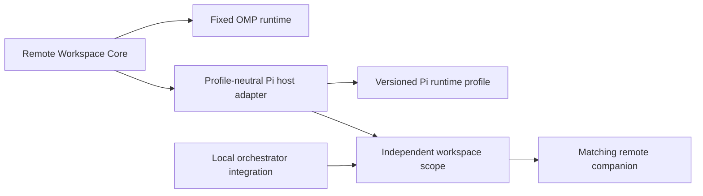

# Remote Workspace Plugins

[简体中文](README.zh-CN.md) | English

This repository contains two independently installable SSH remote-workspace plugins. They share bounded SSH transport, strict host verification, content-addressed deployment, cancellation, and fail-closed routing. Their host runtimes, package manifests, companion binaries, and lifecycle rules are separate.

| Package        | Host              | Remote runtime                               | Documentation                            |
| -------------- | ----------------- | -------------------------------------------- | ---------------------------------------- |
| `packages/omp` | Oh My Pi `17.3.3` | OMP native `ToolSession`, 11 workspace tools | [OMP SSH Remote](packages/omp/README.md) |
| `packages/pi`  | Pi Agent `0.84.2` | Headless Pi + AFT `0.51.2`, 19 tools         | [Pi SSH Remote](packages/pi/README.md)   |

Do not install the repository root. Build from the root, then link only the package for the host you use:

```bash
bun install --frozen-lockfile
bun run build
bun run build:worker:all
bun run build:pi-worker:all
```

OMP:

```bash
omp plugin link "$PWD/packages/omp"
```

Pi Agent:

```bash
pi install "$PWD/packages/pi"
```

Both packages provide `/remote-connect`, `/remote-status`, `/remote-exit`, plus model-callable `remote_connect`, `remote_workspace_status`, and `remote_exit` tools. See the package README before installation; the Pi package has an explicit extension-order requirement because Pi resolves duplicate tools first-wins.

## Repository Layout

```text
packages/omp/                  OMP-only manifest, docs, extension, and workers
packages/pi/                   Pi-only manifest, docs, extension, and profile artifacts
src/runtime-contract.ts        host-neutral runtime handshake and artifact contract
src/omp/                       fixed OMP runtime admission contract
src/pi/host-extension.ts       profile-neutral Pi host adapter
src/pi/profile.ts              Pi profile descriptor contract
src/pi/profiles/               version-locked remote runtime profiles
src/pi/scope.ts                one companion lifecycle per Pi workspace scope
src/pi/integrations/           local orchestrator integration contracts
scripts/                       host-specific builds, smokes, and benchmarks
test/                          shared-core and host-specific contracts
```

## Architecture

The OMP and Pi products deliberately use different extension models over the same transport and deployment core. OMP has one fixed, version-locked native workspace runtime. Pi is profile-driven: the host adapter selects a declared profile, deploys that profile's artifact bundle, validates its exact runtime manifest, and registers only the admitted tool schemas.

The current Pi registry contains one profile, `pi-aft`, for Pi `0.84.2` plus AFT `0.51.2`. The `pi-subagents` integration only carries the selected profile and connection scope into a child Pi process; it does not define the remote runtime. Unknown Pi plugins are never inferred as remote-capable. A future plugin either belongs in a versioned remote profile, a local orchestration integration, or the local control plane.



## Development Verification

```bash
bun run check
REMOTE_ALIAS=<ssh-alias> REMOTE_CWD=<remote-path> bun run benchmark:omp
REMOTE_ALIAS=<ssh-alias> REMOTE_CWD=<remote-path> bun run benchmark:pi
```

Workers are large generated artifacts and are ignored by Git. Source installation requires building the worker binaries locally before linking the package.

## License

[MIT](LICENSE)
