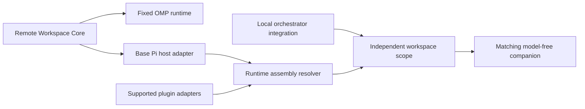

# Remote Workspace Plugins

[简体中文](README.zh-CN.md) | English

This repository contains two independently installable SSH remote-workspace plugins. They share bounded SSH transport, strict host verification, content-addressed deployment, cancellation, and fail-closed routing. Their host runtimes, package manifests, companion binaries, and lifecycle rules are separate.

| Package | Host | Remote runtime | Documentation |
| --- | --- | --- | --- |
| `packages/omp` | Oh My Pi `17.3.3` | OMP native `ToolSession`, 11 workspace tools | [OMP SSH Remote](packages/omp/README.md) |
| `packages/pi` | Compatible current Pi Agent | Composable Pi core plus detected supported plugin adapters | [Pi SSH Remote](packages/pi/README.md) |

Do not install the repository root. Build from the root, then link only the package for the host you use:

```bash
bun install --frozen-lockfile
bun run build
bun run build:worker:all
bun run build:pi-worker:all
```

OMP:

```bash
omp plugin link "$PWD/packages/omp"
```

Pi Agent:

```bash
pi install "$PWD/packages/pi"
```

Both packages provide `/remote-connect`, `/remote-status`, `/remote-exit`, plus model-callable `remote_connect`, `remote_workspace_status`, and `remote_exit` tools. See the package README before installation; the Pi package has an explicit extension-order requirement because Pi resolves duplicate tools first-wins.

## Repository Layout

```text
packages/omp/                  OMP-only manifest, docs, extension, and workers
packages/pi/                   Pi-only manifest, docs, extension, and workers
src/runtime-contract.ts        host-neutral runtime handshake and artifact contract
src/omp/                       fixed OMP runtime admission contract
src/pi/assembly.ts             Pi host/plugin capability resolver and RuntimeAssembly
src/pi/plugins/                independently pluggable Pi workspace adapters
src/pi/host-extension.ts       Pi host lifecycle adapter for the resolved assembly
src/pi/worker-runtime.ts       model-free worker assembled from requested components
src/pi/scope.ts                one companion lifecycle per Pi workspace scope
src/pi/integrations/           local orchestrator integration contracts
scripts/                       host-specific builds, smokes, and benchmarks
test/                          shared-core and host-specific contracts
```

## Architecture

OMP and Pi deliberately use different extension models over the same transport and deployment core. OMP has one fixed native workspace runtime: local OMP and the bundled companion must both be `17.3.3`. The remote host does not install OMP; `ompVersion` is the worker identity.

Pi first adapts the base host and then computes a runtime assembly from the current active tool registry and explicitly supported plugin adapters. A Pi `RuntimeAssembly` records component contracts, actual resolved versions, active tool ownership and schemas, and required artifacts. Versions are retained for identity and diagnostics but are not equality gates. The remote worker may use different Pi/plugin versions when its component contracts and exact tool schemas remain compatible. Unknown plugins are never inferred as remote-capable.

The current registry supports pure Pi and Pi with the AFT adapter. `pi-subagents` is a local orchestrator: it inherits the serialized assembly and SSH connection through the process environment and opens an independent companion. It does not define the remote runtime. Ordinary child sessions use the parent remote cwd.



## Development Verification

```bash
bun run check
REMOTE_ALIAS=<ssh-alias> REMOTE_CWD=<remote-path> bun run benchmark:omp
REMOTE_ALIAS=<ssh-alias> REMOTE_CWD=<remote-path> bun run benchmark:pi
REMOTE_TARGET=<ssh-alias> REMOTE_CWD=<remote-path> PI_SMOKE_PLUGINS=none bun scripts/smoke-pi-assembly.ts
REMOTE_TARGET=<ssh-alias> REMOTE_CWD=<remote-path> PI_SMOKE_PLUGINS=aft bun scripts/smoke-pi-assembly.ts
```

The two Pi smoke modes exercise the pure Pi and Pi+AFT assemblies through the same extension, SSH deployment, worker, tool-routing, and restoration lifecycle.

Workers are large generated artifacts and are ignored by Git. Source installation requires building the worker binaries locally before linking the package.

## License

[MIT](LICENSE)
