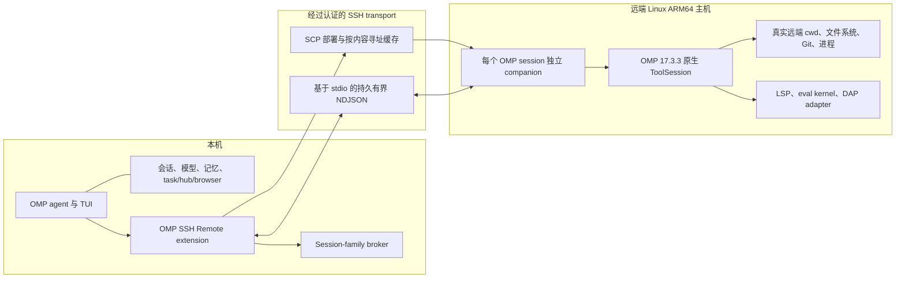

# OMP SSH Remote

简体中文 | [English](README.md)

OMP SSH Remote 让 Oh My Pi（OMP）的控制面留在本机，同时通过 SSH 在远端主机的常驻 companion 进程中执行 OMP 原生工作区工具。

本机进程继续负责 TUI、对话、会话、模型凭据、Magic Context 和控制面工具。远端 companion 则直接操作远端主机的真实文件系统、进程、依赖、Git 工作区、语言服务器、eval kernel 和调试适配器。

> [!IMPORTANT]
> 当前仓库是 Git 源码预览版，固定使用 OMP `17.3.3`、protocol version `1` 和 worker runtime `0.3.0`。安装过程是克隆该仓库、在本机构建，并将这个 checkout 链接到 OMP。目前尚未提供预编译 Release、npm 发布或基于 registry 的插件安装。

## 为什么需要这个项目

远端工作区并不等于简单执行 `ssh host command`。OMP 的文件编辑、hashline snapshot、AST proposal、LSP client、eval kernel 和 debug session 都需要跨多次工具调用保持状态。让这些原生工具在同一个远端 companion 中运行，才能保留 OMP 原生行为，并确保所有工作区操作处于同一个远端路径和进程域。

该架构避免了以下问题：

- 把远端文件系统挂载到一个不同的本机路径；
- 将每个 OMP 工具重新实现成 SSH 或 SFTP wrapper；
- 在远端运行带模型凭据和完整对话状态的 OMP agent；
- 远端连接失败后静默操作本机文件。

## 开始之前

只有同时满足以下条件时，当前 Git 安装方式才适用：

- OMP 运行在 Linux 或 WSL 本机，且版本严格为 `17.3.3`；
- 本机构建机可以运行 Bun `1.3+`、Git、npm、tar、SSH 和 SCP；
- 远端主机是 glibc Linux `aarch64`；
- 公钥 SSH 已经可以在不交互输入登录密码的情况下工作；
- 项目已经存在于远端主机的某个绝对路径。

本机构建机**不需要**是 ARM64。Linux x64 和 x64 WSL 可以交叉构建 ARM64 companion。远端主机不需要安装 Bun 或 OMP。

如果环境不符合这些条件，不要绕过版本检查或 SSH 安全检查。更多平台和预编译安装属于后续路线图。

本 README 中的主机名、用户名、路径、端口和私钥文件名全部是占位示例，必须替换成自己的值。

## 架构



### 执行流程

1. `/remote-connect` 通过 SSH 探测远端平台和 home 目录。
2. extension 找到本机构建的 Linux ARM64 companion，并读取其 SHA-256 sidecar。
3. 缓存未命中时，SCP 将 companion 上传到 `~/.cache/omp-ssh-remote/<omp-version>/<sha256>/worker`，校验 hash 后原子启用。
4. 一条持久 SSH stdio 通道承载初始化、工具调用、partial update、取消、结果和 shutdown。
5. 远端 worker 在指定远端工作目录内调用 OMP 原生工具实现。
6. 连接或协议失败后，已选择的工作区工具会 fail closed，绝不会意外回退到本机工作区执行。

### 会话和子代理隔离

父 OMP session 和每个普通非隔离子 session 都使用独立的远端 companion。它们只共享 SSH ControlMaster 和已缓存的 binary，不共享 edit snapshot、AST proposal、eval kernel 或 debug session。

选择远端模式后，OMP 的 session switch、branch、fork 和 handoff 会被阻止。执行这些操作前应先使用 `/remote-exit` 断开。

### 本文术语

- **控制面（control plane）：** 本机 OMP 进程，负责对话、模型访问、凭据、记忆和任务编排。
- **companion：** 远端最小进程，只执行 OMP 原生工作区工具，不运行模型或 agent loop。
- **fail closed：** 远端发生故障后，工作区调用明确报错，而不是静默改为操作本机文件。
- **按内容寻址缓存（content-addressed cache）：** 以 binary SHA-256 选择远端 worker 目录，同一构建只上传一次。
- **session family：** 一个父 OMP session 及其普通非隔离子 session；每个成员使用独立 companion。
- **LSP / DAP：** 语言服务器和调试协议；项目所需 server 和 adapter 必须安装在远端主机。
- **hashline / AST proposal：** OMP 的有状态文件编辑和语法编辑流程，状态保存在创建它的 companion 中。

## 工具路由

extension 只替换宿主 OMP session 中原本已启用的工具，不会暴露用户配置中禁用的工具。

| 执行位置         | 能力                                                                                                                           |
| ---------------- | ------------------------------------------------------------------------------------------------------------------------------ |
| 远端原生 runtime | `read`、`write`、`edit`、`bash`、`grep`、`glob`、`lsp`、`ast_grep`、`ast_edit`、`eval`、`debug`                                |
| 本机控制面       | TUI、session、模型调用、凭据、Magic Context、memory、`ask`、`task`、`hub`、`todo`、browser/computer、web search、security scan |
| 本机内部资源     | `skill://`、`agent://`、`history://`、`artifact://`、`memory://`、`local://` 等 URI resource                                   |

路由规则：

- 普通相对路径和绝对文件路径在远端执行；
- 任意 `scheme://` URI 留在本机；
- 同一次工具调用不能混用本机 URI resource 和远端文件路径；
- 原生 LSP 和 AST 工具保留宿主 OMP 的顶层或 `xd://` 调用形式；
- `ast_edit` proposal 及其之后的 resolve/reject 始终返回同一个 `ToolSession`；
- 远端 eval 只能调用受限的远端工作区 helper，不能访问本机控制面工具。

## 当前支持范围

### 已验证

- 本机 OMP：`17.3.3`。
- 本机构建环境：Linux 或 WSL，Bun `1.3` 或更新版本。
- 远端 worker：glibc Linux `aarch64`。
- 远端主机需要 SSH 访问，但不需要安装 Bun、npm 或 OMP。
- 前台 Bash 流式输出和取消。
- 持久 hashline edit、AST proposal resolution、LSP、Python/JavaScript eval 状态和 DAP debug session。
- 普通非隔离 `task` 子代理，且每个子代理有独立 companion 状态。

### 尚未支持

- macOS、Windows、Linux x64 或 musl 远端 worker；
- 预编译 GitHub Release 或 npm 安装；
- `bash async:true` 和自动后台任务；
- `task isolated:true` 远端 worktree；
- 将远端 artifact 传入本机 artifact store；
- 超过 16 MiB protocol frame 的输出；
- 远端 eval 模型调用、子代理、递归 eval 或嵌套有状态 `ast_edit` proposal。

## 从源码安装

### 1. 准备环境

在运行 OMP 的本机安装：

- OMP，版本必须为 `17.3.3`；
- Bun `1.3` 或更新版本；
- Git；
- npm；
- tar；
- OpenSSH client 和 SCP。

如果尚未安装 OMP，使用 Bun 安装当前支持的精确版本：

```bash
bun install -g @oh-my-pi/pi-coding-agent@17.3.3
```

检查版本：

```bash
omp --version
bun --version
git --version
npm --version
ssh -V
command -v scp
tar --version
```

`omp --version` 必须输出 `omp/17.3.3`。如果 OMP 版本不一致，protocol handshake 会主动拒绝连接，避免 schema 不一致导致错误执行。

构建脚本会从 npm 下载与 OMP 版本严格匹配的官方 Linux ARM64 native addon，并生成约 134 MiB 的自包含 companion。Linux x64 和 x64 WSL 可以通过 Bun 交叉构建 ARM64 executable。本机构建机需要能够访问 npm registry，并提供足够的临时磁盘空间存放 native package 和输出 binary。

### 2. 克隆 Git 仓库

在仓库 GitHub 页面选择 **Code → HTTPS**，复制页面显示的地址，然后执行：

```bash
git clone <copied-repository-url> omp-ssh-remote
cd omp-ssh-remote
```

将 `<copied-repository-url>` 替换成从 GitHub 复制的地址，不要原样输入尖括号。如果不使用 Git 命令行，可以选择 **Code → Download ZIP**，解压后在 `omp-ssh-remote` 目录中打开终端。ZIP 安装可以使用，但不能通过 `git pull` 更新。

### 3. 安装依赖并构建

```bash
bun install --frozen-lockfile
bun run check
bun run build:worker:arm64
```

构建完成后应存在：

```text
dist/extension.js
dist/worker.js
dist/worker-linux-arm64
dist/worker-linux-arm64.sha256
```

`bun run check` 会执行 TypeScript 检查，分别构建 extension 和开发用 worker，并运行本地行为测试；它不会连接远端服务器。如果该命令失败，不要继续安装。`build:worker:arm64` 负责生成远端自包含 binary。

### 4. 将 Git checkout 链接到 OMP

在包含 `package.json` 的仓库根目录执行，不要链接 `dist/`：

```bash
omp plugin link "$PWD"
omp plugin list
```

`plugin link` 不会下载或复制项目，它只会让 OMP 链接当前 checkout，因此必须保留仓库目录。`omp plugin list` 应显示 `omp-ssh-remote` 版本 `0.6.0`。

完全退出所有正在运行的 OMP 进程并重新启动。在重新启动的 OMP session 中执行：

```text
/remote-status
```

尚未连接时应显示：

```text
Remote runtime: disconnected (local tools active)
```

如果 OMP 不识别 `/remote-status`，请查看[故障排查](#故障排查)。

## 准备远端主机

### 1. 检查远端平台

当前 bundled worker 要求 Linux `aarch64`：

```bash
ssh developer@remote.example.com 'uname -s; uname -m'
```

预期输出：

```text
Linux
aarch64
```

如果使用非默认端口和指定私钥：

```bash
ssh -p 2222 -i ~/.ssh/remote_workspace_ed25519 \
  developer@remote.example.com 'uname -s; uname -m'
```

### 2. 验证 SSH host key

先从服务器管理员、云平台控制台或其他可信渠道取得服务器 SSH host-key fingerprint。然后进行一次普通 SSH 连接，在接受 key 前核对终端显示的 fingerprint：

```bash
ssh -p 2222 -i ~/.ssh/remote_workspace_ed25519 \
  developer@remote.example.com
```

经过确认的 key 通常会保存到 `~/.ssh/known_hosts`。extension 强制启用 `StrictHostKeyChecking=yes`，不会自动接受未知或发生变化的 key。不要通过关闭该检查来绕过错误。

限制私钥文件权限：

```bash
chmod 600 ~/.ssh/remote_workspace_ed25519
```

如果私钥已加密，在启动 OMP 前先将它加入 SSH agent：

```bash
eval "$(ssh-agent -s)"
ssh-add ~/.ssh/remote_workspace_ed25519
```

最后执行一条与 extension 认证模式一致的非交互测试：

```bash
ssh -o BatchMode=yes -o IdentitiesOnly=yes \
  -p 2222 -i ~/.ssh/remote_workspace_ed25519 \
  developer@remote.example.com 'printf ready'
```

只有当该命令不询问登录密码或私钥 passphrase，并直接输出 `ready` 时才能继续。

### 3. 准备项目目录

项目必须已经存在于远端主机。OMP SSH Remote 不会镜像或同步本机代码仓库。

例如，可以先在远端克隆项目：

```bash
ssh -p 2222 -i ~/.ssh/remote_workspace_ed25519 \
  developer@remote.example.com \
  'git clone https://example.com/organization/project.git /home/developer/project'
```

如果传入远端工作目录，它必须是已经存在的绝对路径；其中的 `~` 不会进行 shell 展开。省略目录时，extension 使用远端账号的 `$HOME`。本机 identity 和 known-hosts 路径中的 `~` 则会由 extension 展开。

## 连接和使用

### 一次保存服务器名称

使用 OMP 内置 SSH 主机注册表保存地址、用户、端口和私钥路径。以下命令在系统终端中执行：

```bash
omp ssh add modelarts \
  --host remote.example.com \
  --user developer \
  --port 2222 \
  --key ~/.ssh/remote_workspace_ed25519 \
  --scope user
```

`--scope user` 让该名称可用于本机所有项目；如只希望当前项目使用，改为 `--scope project`。查看已保存名称：

```bash
omp ssh list
```

SSH 主机注册表不会绕过 host-key 校验。使用简洁命令前，经过核验的 key 必须已经位于标准 `~/.ssh/known_hosts` 文件中。

### 按名称连接

在本机启动 OMP，然后在 OMP 输入框中执行，而不是在系统终端中执行：

```text
/remote-connect modelarts
```

只给服务器名称时，远端工作区默认为该账号的 `$HOME`。如需进入已经存在的项目目录：

```text
/remote-connect modelarts /home/developer/project
```

### 一次性完整连接

未配置 OMP SSH 名称时，仍可使用完整形式：

```text
/remote-connect developer@remote.example.com /home/developer/project --port 2222 --identity ~/.ssh/remote_workspace_ed25519 --known-hosts ~/.ssh/known_hosts
```

显式 `--port` 和 `--identity` 会覆盖已保存设置。extension 强制使用 `BatchMode=yes`、`IdentitiesOnly=yes`，禁用 agent forwarding 和 port forwarding，并且不会交互式询问密码或私钥 passphrase。使用 OMP 连接前，上面的 batch-mode 自检必须通过。

### 第一次连接

新 worker hash 第一次连接时会探测平台并上传自包含 binary。约 134 MiB 的首次上传可能需要几十秒。之后会复用远端按内容寻址的缓存，不再重复上传相同 binary。

检查连接状态：

```text
/remote-status
```

### 日常使用

连接成功后正常使用 OMP，无需为每条请求添加 SSH 前缀。例如：

```text
读取 package.json，并说明这个项目如何启动。
```

```text
运行测试，定位失败原因并修复。
```

```text
修改 src/server.ts，然后显示远端 Git diff。
```

此时工作区路径、命令、Git 状态、语言服务器、依赖、eval kernel 和 debugger adapter 都属于远端主机。对话、模型请求、凭据、记忆和控制面工具仍保留在本机。

每次模型请求前，extension 都只会为该次请求临时注入一条工作区状态消息。它报告 `local`、`remote` 或 fail-closed 的 `unavailable`；远端模式下还会携带当前远端工作目录。该消息不会写入 session transcript、不会主动发起模型请求、也不会改写 system prompt。模型请求中的旧版本历史状态消息会被移除。`remote` 表示当前已知的 SSH transport 状态，不会为每次模型请求额外探测网络；SSH keepalive 会在约 90 秒内发现静默断线，之后下一次请求会显示 `unavailable`。`/remote-status` 显示同一份当前已知状态。

### 断开连接

断开前先执行 `/remote-status`。如果 `pending=` 大于 0，使用 `write xd://resolve` 完成暂存的 AST 编辑，或使用 `write xd://reject` 放弃它。等待普通子 session 结束后执行：

```text
/remote-exit
```

需要明确关闭 session family 中的全部 companion、且不等待子 session 时执行：

```text
/remote-exit --force
```

owner session 会恢复本机工作区工具。仍在运行的 child session 会保持 fail-closed 直到结束，绝不会静默切换到本机文件。

## 更新 Git 安装

先在 OMP 中执行 `/remote-exit`，然后完全退出 OMP。在仓库 checkout 目录执行：

```bash
git pull --ff-only
bun install --frozen-lockfile
bun run check
bun run build:worker:arm64
```

已有 plugin link 会继续指向这个 checkout，因此不需要再次执行 `plugin link`。构建后重新启动 OMP。binary 内容改变后会产生新的 SHA-256 缓存目录，并在下一次连接时自动上传。

ZIP 安装不能使用 `git pull`；需要下载新的 ZIP、替换旧 checkout、重新构建，并为新目录执行一次 `omp plugin link "$PWD"`。

## 卸载

先在 OMP 中执行 `/remote-exit`，退出全部 OMP 进程，然后在系统终端中执行：

```bash
omp plugin uninstall omp-ssh-remote
```

确认 `omp plugin list` 不再显示该插件后，可以删除本机 Git checkout。卸载不会删除远端项目文件。远端主机上的内容寻址 worker binary 会保留在 `~/.cache/omp-ssh-remote`，确认没有 session 使用后可以单独清理。

## 安全模型

- SSH host key 必须事先可信，严格校验始终开启。
- SSH 和 SCP 强制使用 `BatchMode=yes`、`IdentitiesOnly=yes`、`ForwardAgent=no` 和 `ClearAllForwardings=yes`。
- 私钥保留在本机，只由 OpenSSH 读取，不会复制到 companion。
- 远端 companion 会接收工具名、参数、工具所需的源码内容以及工具结果。远端账号属于工作区信任边界的一部分。
- companion 不接收 model provider 配置、模型 API key、对话 journal、Magic Context 数据库或浏览器 session。
- worker 不监听 TCP 端口；protocol 只运行在一条经过认证的 SSH stdio 通道上。
- 初始化要求 protocol、runtime 和 OMP 版本完全一致。
- protocol frame 最大 16 MiB，worker stderr 和部署命令输出也分别设有上限。
- 部署流程校验 SHA-256 后，将 mode `0700` 的 worker 原子写入远端用户缓存。
- companion 只使用当前 SSH 远端用户权限运行，不执行提权。

## 性能参考

在一个缓存已命中的 Linux ARM64 SSH 目标上，观测结果如下：

| 操作                       |                   观测延迟 |
| -------------------------- | -------------------------: |
| 缓存部署探测               |                     102 ms |
| companion 初始化           |                     996 ms |
| `read`                     | p50 20.53 ms，p95 30.11 ms |
| 热 `bash`                  |                   约 22 ms |
| worker 启动后的第一次 Bash |                  约 513 ms |
| LSP status                 | p50 20.84 ms，p95 32.52 ms |

这些数据仅作为参考，不是服务等级承诺。网络路径、SSH 认证、远端负载、存储、语言服务器启动和命令本身都会影响延迟。首次缓存未命中的连接还需要上传 companion binary。

## 故障排查

### OMP 不识别 `/remote-status` 或 `/remote-connect`

在仓库根目录重新构建并检查插件：

```bash
bun run check
omp plugin link "$PWD"
omp plugin list
omp plugin doctor
```

然后完全重启 OMP。

### 提示 `ARM64 worker binary not found`

构建自包含 worker：

```bash
bun run build:worker:arm64
```

确认 `dist/worker-linux-arm64` 和对应 `.sha256` sidecar 存在。

### 提示 `Host key verification failed`

先使用普通 `ssh` 命令连接，通过可信渠道核对 fingerprint 后再接受 host key。确认 `/remote-connect --known-hosts` 指向同一个文件。不要设置 `StrictHostKeyChecking=no`。

### 提示 `Permission denied (publickey)`

检查目标用户名、端口、私钥路径、私钥权限和服务器 `authorized_keys`。先在 OMP 外使用完全相同的 SSH 参数测试。extension 使用 batch mode，不支持仅密码认证。

### 提示 `No bundled worker for remote platform`

在远端执行 `uname -s` 和 `uname -m`。当前构建只支持 glibc Linux `aarch64`。

### 提示远端工作目录不存在

传入已存在的绝对路径。执行 `/remote-connect` 前先在远端创建目录或克隆项目。工作目录参数中不要使用 `~`。

### 提示版本或 handshake 不匹配

使用 OMP `17.3.3`，拉取匹配的源码 revision，重新构建 extension 和 worker，然后重启 OMP。runtime 会主动拒绝版本不一致的连接。

### 远端连接意外中断

`/remote-status` 会显示 fail-closed 状态，工作区工具不会回退本机。执行 `/remote-exit --force`，检查 SSH 连接后重新连接。

### Bash 后台执行被拒绝

这是当前预期行为。在远端 job ID、日志、等待和取消能够安全映射到本机 `hub` 前，remote async job 保持禁用。请改用前台命令。

### 文件工具正常，但 LSP 或 debug 失败

远端主机必须安装并能正常运行项目所需的 language server 或 DAP adapter。companion 复用远端环境，不会打包项目专用的语言服务器或调试适配器。

### 结果超过 frame 限制

单个 protocol frame 不能超过 16 MiB。请缩小 read、search 或命令输出范围。远端 artifact transfer 尚未实现。

## 维护者验证

本地验证：

```bash
bun run check
```

构建 ARM64 worker 后进行远端验证：

```bash
export REMOTE_TARGET='developer@remote.example.com'
export REMOTE_PORT=2222
export REMOTE_IDENTITY="$HOME/.ssh/remote_workspace_ed25519"
export REMOTE_KNOWN_HOSTS="$HOME/.ssh/known_hosts"
export REMOTE_CWD='/home/developer/omp-ssh-remote-probe'

bun scripts/smoke-remote.ts
bun scripts/smoke-extension.ts
bun scripts/smoke-subagent.ts
bun scripts/benchmark-remote.ts
```

应使用一次性远端目录，smoke 脚本会创建和修改 probe 文件。

## 路线图

- 发布签名 GitHub Release asset，使用户无需源码构建工具链即可安装；
- 为更多远端平台提供版本化 worker；
- 将远端 async job 接入本机 `hub jobs/logs/wait/cancel`；
- 实现远端 isolated worktree 的创建和 merge lifecycle；
- 将大型远端结果桥接到本机 artifact store；
- 扩展对更多 OMP 版本的兼容测试。

## 许可证

[MIT](LICENSE)
