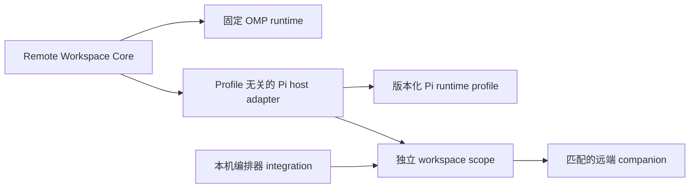

# 远端工作区插件

简体中文 | [English](README.md)

本仓库包含两个可独立安装的 SSH 远端工作区插件。它们共用有界 SSH transport、严格主机校验、按内容寻址部署、取消和 fail-closed 路由；但宿主 runtime、package manifest、companion binary 和生命周期规则彼此独立。

| Package        | 宿主              | 远端 runtime                            | 文档                                           |
| -------------- | ----------------- | --------------------------------------- | ---------------------------------------------- |
| `packages/omp` | Oh My Pi `17.3.3` | OMP 原生 `ToolSession`，11 个工作区工具 | [OMP SSH Remote](packages/omp/README.zh-CN.md) |
| `packages/pi`  | Pi Agent `0.84.2` | Headless Pi + AFT `0.51.2`，19 个工具   | [Pi SSH Remote](packages/pi/README.zh-CN.md)   |

不要安装仓库根目录。先在根目录构建，再只链接所用宿主对应的 package：

```bash
bun install --frozen-lockfile
bun run build
bun run build:worker:all
bun run build:pi-worker:all
```

OMP：

```bash
omp plugin link "$PWD/packages/omp"
```

Pi Agent：

```bash
pi install "$PWD/packages/pi"
```

两个 package 都提供 `/remote-connect`、`/remote-status`、`/remote-exit`，并提供模型可调用的 `remote_connect`、`remote_workspace_status` 和 `remote_exit` 工具。安装前请阅读对应 package README；Pi 的同名工具采用 first-wins，因此 Pi package 有明确的 extension 加载顺序要求。

## 仓库布局

```text
packages/omp/                  仅 OMP 的 manifest、文档、extension 和 workers
packages/pi/                   仅 Pi 的 manifest、文档、extension 和 profile artifacts
src/runtime-contract.ts        宿主无关的 runtime handshake 与 artifact 合同
src/omp/                       固定 OMP runtime 的准入合同
src/pi/host-extension.ts       profile 无关的 Pi host adapter
src/pi/profile.ts              Pi profile descriptor 合同
src/pi/profiles/               版本锁定的远端 runtime profiles
src/pi/scope.ts                每个 Pi workspace scope 独占 companion 生命周期
src/pi/integrations/           本机编排器 integration 合同
scripts/                       分宿主 build、smoke 和 benchmark
test/                          共享 core 与分宿主行为合同
```

## 架构

OMP 与 Pi 产品在同一 transport 和部署 core 上采用不同的 extension 模型。OMP 只有一套固定、版本锁定的原生工作区 runtime。Pi 由 profile 驱动：host adapter 选择已声明的 profile，部署该 profile 的 artifact bundle，严格校验 runtime manifest，并且只注册通过准入的工具 schema。

当前 Pi registry 只有一个 profile：面向 Pi `0.84.2` 与 AFT `0.51.2` 的 `pi-aft`。`pi-subagents` integration 只把已选 profile 和连接 scope 传给新的 Pi 子进程，并不定义远端 runtime。未知 Pi plugin 不会被推断为可远端执行。未来插件必须明确归入版本化远端 profile、本机编排 integration 或本机控制面之一。



## 开发验证

```bash
bun run check
REMOTE_ALIAS=<ssh-alias> REMOTE_CWD=<remote-path> bun run benchmark:omp
REMOTE_ALIAS=<ssh-alias> REMOTE_CWD=<remote-path> bun run benchmark:pi
```

worker 是体积较大的生成产物，不进入 Git。源码安装必须先在本机构建 worker binary，再链接对应 package。

## 许可证

[MIT](LICENSE)
