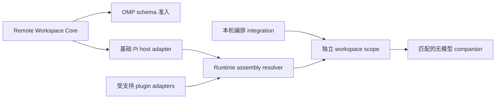

# 远端工作区插件

简体中文 | [English](README.md)

本仓库包含两个可独立安装的 SSH 远端工作区插件。它们共用有界 SSH transport、严格主机校验、按内容寻址部署、取消和 fail-closed 路由；但宿主 runtime、package manifest、companion binary 和生命周期规则彼此独立。

| Package        | 宿主                | 远端 runtime                                    | 文档                                           |
| -------------- | ------------------- | ----------------------------------------------- | ---------------------------------------------- |
| `packages/omp` | Oh My Pi `>=18.0.0` | OMP 原生 `ToolSession`，11 个工作区工具         | [OMP SSH Remote](packages/omp/README.zh-CN.md) |
| `packages/pi`  | 兼容的当前 Pi Agent | 可组合 Pi core 与检测到的受支持 plugin adapters | [Pi SSH Remote](packages/pi/README.zh-CN.md)   |

不要安装仓库根目录。先在根目录构建，再只链接所用宿主对应的 package：

```bash
bun install --frozen-lockfile
bun run build
bun run build:worker:all
bun run build:pi-worker:all
```

OMP：

```bash
omp plugin link "$PWD/packages/omp"
```

Pi Agent：

```bash
pi install "$PWD/packages/pi"
```

两个 package 都提供 `/remote-connect`、`/remote-status`、`/remote-exit`，并提供模型可调用的 `remote_connect`、`remote_workspace_status` 和 `remote_exit` 工具。安装前请阅读对应 package README；Pi 的同名工具采用 first-wins，因此 Pi package 有明确的 extension 加载顺序要求。

## 仓库布局

```text
packages/omp/                  仅 OMP 的 manifest、文档、extension 和 workers
packages/pi/                   仅 Pi 的 manifest、文档、extension 和 workers
src/runtime-contract.ts        宿主无关的 runtime handshake 与 artifact 合同
src/omp/                       OMP 能力/schema 准入合同
src/pi/assembly.ts             Pi host/plugin capability resolver 与 RuntimeAssembly
src/pi/plugins/                可独立拔插的 Pi workspace adapters
src/pi/host-extension.ts       消费已解析 assembly 的 Pi host 生命周期 adapter
src/pi/worker-runtime.ts       根据请求组件装配的无模型 worker
src/pi/scope.ts                每个 Pi workspace scope 独占 companion 生命周期
src/pi/integrations/           本机编排器 integration 合同
scripts/                       分宿主 build、smoke 和 benchmark
test/                          共享 core 与分宿主行为合同
```

## 架构

OMP 与 Pi 在同一 transport 和部署 core 上采用不同的 extension 模型。OMP 只有一套原生工作区 runtime：本机 OMP 与 companion 通过 runtime 契约和精确原生工具 schema 互相准入。宿主包版本只保留为身份元数据，不是相等门禁。远端主机不安装 OMP。

Pi 首先适配基础 host，再根据当前 active tool registry 和已明确支持的 plugin adapters 计算 runtime assembly。Pi `RuntimeAssembly` 记录 component contracts、实际解析版本、active tool ownership、schema 和必需 artifacts。版本会保留用于身份和诊断，但不作为相等准入条件。只要 component contract 和精确工具 schema 仍兼容，远端 worker 可以使用不同的 Pi/plugin 版本。未知 plugin 永远不会被推断为可远端执行。

当前 registry 支持仅 Pi core，以及由满足各自独立准入合同的 plugin adapter 扩展的 Pi core。`@tintinweb/pi-subagents` 是当前 in-process 编排 integration：一个已连接的 root session 可以创建多个普通 child。默认 Pi extension 会根据活跃 root owner 识别新的同进程 child；限制 extension 加载的自定义 agent 使用 `pi-tintin-extension.js`。每个 child 恢复父 session 已验证的 assembly、保留本机 Pi cwd，并在父 session 的远端 cwd 上打开独立 companion。同一进程中的第二个独立 root 会被拒绝。它不定义远端 runtime。它的本机 `isolation: "worktree"` 模式不支持远端连接态；真实 SSH smoke 仍是该 integration 的外部 acceptance gate。



## 开发验证

```bash
bun run check
bun run build:pi-worker:all
REMOTE_ALIAS=<ssh-alias> REMOTE_CWD=<remote-path> bun run benchmark:omp
REMOTE_ALIAS=<ssh-alias> REMOTE_CWD=<remote-path> bun run benchmark:pi
REMOTE_TARGET=<ssh-alias> REMOTE_CWD=<remote-path> PI_SMOKE_PLUGINS=none bun scripts/smoke-pi-assembly.ts
REMOTE_TARGET=<ssh-alias> REMOTE_CWD=<remote-path> PI_SMOKE_PLUGINS=aft bun scripts/smoke-pi-assembly.ts
REMOTE_TARGET=<ssh-alias> REMOTE_CWD=<remote-path> PI_TINTIN_SUBAGENTS_ENTRY=<tintin-entry> bun scripts/smoke-pi-tintin-subagent.ts
```

Pi assembly smoke 通过同一套 extension、SSH deployment、worker、tool routing 和恢复生命周期，验证仅 Pi core 和由当前 active adapter 集合扩展的 assembly。tintin smoke 额外验证普通 in-process child 会启动自己的 companion，并在远端工作区执行 `hostname` 和 `pwd`；它不覆盖本机 worktree isolation。

worker 是体积较大的生成产物，不进入 Git。源码安装必须先执行 `bun run build:pi-worker:all` 构建 worker binary，再链接对应 package。

## 许可证

[MIT](LICENSE)
