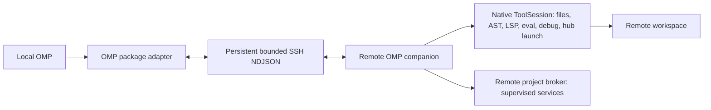

# OMP SSH Remote

[简体中文](README.zh-CN.md) | English

OMP SSH Remote keeps the Oh My Pi control plane local while executing stateful native workspace tools in a persistent companion on a remote Linux host over SSH. This package is OMP-only. Pi Agent support is a separate package at [`../pi`](../pi/README.md).

## Runtime Boundary

Local OMP retains the TUI, conversation, model credentials, sessions, Magic Context, `task`, `todo`, browser/computer, peer messaging, and background-job bookkeeping. One remote companion per OMP session owns the remote filesystem, foreground processes, hashline snapshots, AST proposals, LSP clients, eval kernels, debugger sessions, and the project's supervised-process broker.

Remote native tools:

`read`, `write`, `edit`, `bash`, `grep`, `glob`, `lsp`, `ast_grep`, `ast_edit`, constrained `eval`, `debug`, and the process-supervision half of `hub`.

Background execution is split by ownership rather than by tool name:

- `bash async:true` creates a local OMP background job that owns the id, status, logs, cancellation, and `hub jobs` visibility while the companion runs the command in the foreground; `hub cancel`, session exit, or transport loss aborts the remote command.
- `hub start/ps/logs/stop/restart/describe`, and `send`/`wait` addressed to a process `name`, run in the native OMP broker on the remote host, so the service starts beside the project with the remote environment. Process exit notifications reach the local model exactly as native launch completions do. `hub list/inbox/jobs/cancel` and peer `send`/`wait` never leave the local host.
- On `/remote-exit`, session shutdown, or transport loss the companion stops the supervised processes this session started unless they were launched with `persist` or `detached`; those survive by explicit request, like native OMP.

Ordinary non-isolated subagents inherit the connection configuration but receive independent companion processes. Admission compares the remote execution contract and native tool schemas; hub's local peer/job fields are excluded. `task isolated:true` remains explicitly rejected. Native host approval rules are preserved and connection waits for wrapper activation.

Truncated output is stored remotely under `~/.cache/omp-ssh-remote/artifacts`. Use returned `remote-artifact://<namespace>/<id>` references with `read` selectors or `grep` while connected to that host. These files persist across disconnects; they are not copied locally or automatically expired. Local `artifact://` references remain local. The `xd://debug` entry executes remotely like direct debug.



## Requirements

- local Linux or WSL with OMP `>=18.0.0`, Bun `1.3+`, npm, tar, OpenSSH, and SCP;
- remote glibc Linux `x86_64` or `aarch64`;
- public-key SSH that succeeds in batch mode;
- an existing remote project directory;
- the remote host needs project-specific language servers and debug adapters, but does not need Bun or OMP.

Host key verification is strict. Trust a host through normal OpenSSH `known_hosts`; do not disable host checking. Agent forwarding and SSH forwarding are disabled.

## Build and Install

From the repository root:

```bash
bun install --frozen-lockfile
bun run build:omp
bun run build:worker:all
omp plugin link "$PWD/packages/omp"
```

The package must contain:

```text
packages/omp/dist/extension.js
packages/omp/dist/worker-linux-x64
packages/omp/dist/worker-linux-x64.sha256
packages/omp/dist/worker-linux-arm64
packages/omp/dist/worker-linux-arm64.sha256
```

Restart OMP after linking. Updating requires `git pull`, rebuilding the extension and workers, then restarting or reloading the plugin. Reloading while connected closes that session's companion; reconnect afterward.

## Connect and Operate

Use a standard `~/.ssh/config` alias or an OMP `/ssh add` entry:

```text
/remote-connect gpu-box /srv/project
/remote-status
/remote-exit
```

Explicit form:

```text
/remote-connect user@example.com /srv/project --port 22 --identity ~/.ssh/id_ed25519
```

The model can invoke the same lifecycle through `remote_connect`, `remote_workspace_status`, and `remote_exit`. Status is on-demand and reports in-process state; it is not a per-turn prompt and does not actively ping SSH.

Ordinary filesystem paths route remotely while connected. Internal URI resources remain local. Mixed local-URI and remote-path operations are rejected. A selected connection that becomes unavailable remains fail-closed until `/remote-exit` explicitly restores local execution.

## Deployment and Security

The adapter probes remote platform and home, selects the matching package-owned worker, verifies its local SHA-256 sidecar, uploads to a UUID temporary path, verifies the remote SHA-256, then atomically activates it under:

```text
~/.cache/omp-ssh-remote/omp-1/<sha256>/worker-linux-<arch>
```

Protocol frames are limited to 16 MiB; deployment stdout/stderr is limited to 1 MiB. SSH uses batch mode, strict host checking, `ForwardAgent=no`, and `ClearAllForwardings=yes`. Transport loss rejects pending calls and never retries them locally. Foreground child processes receive cancellation; deliberately detached commands such as `nohup` or `setsid` are unmanaged remote processes and can survive disconnect.

## Verified Performance

Cached trial host measurements on Linux x86_64, persistent SSH ControlMaster, August 2026:

| Operation | Result |
| --- | --- |
| cached deployment probe | `72.17 ms` |
| companion initialization | `1487.46 ms` |
| read p50 / p95 | `18.01 / 34.36 ms` |
| foreground Bash p50 / p95 | `16.23 / 134.45 ms` |
| LSP status p50 / p95 | `20.05 / 38.11 ms` |

First upload of the x64 worker took `32.7 s`; cached connections avoid that transfer. Results are acceptance evidence, not a network-independent guarantee.

## Limits

- Linux glibc x86_64 and ARM64 only;
- OMP `>=18.0.0` with matching compiled companion schemas;
- explicit async Bash is supported; automatic backgrounding and interactive Bash PTY are not bridged;
- no `task isolated:true` remote worktrees;
- no remote-to-local artifact bridge;
- no output frame above 16 MiB;
- no remote browser, desktop, model credentials, memory, or local session control plane.
