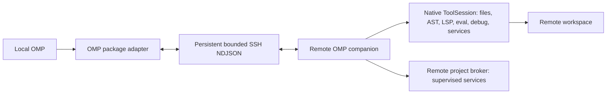

# OMP SSH Remote

[简体中文](README.zh-CN.md) | English

OMP SSH Remote keeps the Oh My Pi control plane local while executing stateful native workspace tools in a persistent companion on a remote Linux host over SSH. This package is OMP-only. Pi Agent support is a separate package at [`../pi`](../pi/README.md).

## Runtime Boundary

Local OMP retains the TUI, conversation, model credentials, sessions, Magic Context, `task`, `todo`, browser/computer, peer messaging, and background-job bookkeeping. One remote companion per OMP session owns the remote filesystem, foreground processes, hashline snapshots, AST proposals, LSP clients, eval kernels, debugger sessions, and the project's supervised-process broker.

Remote native tools:

`read`, `write`, `edit`, `bash`, `grep`, `glob`, `lsp`, `ast_grep`, `ast_edit`, constrained `eval`, and `debug`.

Background execution is split by ownership rather than by tool name:

- `bash async:true` creates a local OMP job; native `wait` and job `proc://` reads/cancellation remain local while the command executes remotely.
- Named `bash` calls launch remote services. Service `proc://<name>` reads and writes (including `/kill` and `/mode`) execute remotely. Bare `read proc://` combines local and remote listings. Local jobs and agents take precedence over service names; conflicting names are rejected at launch. A local coordination job makes remote service exits visible to native `wait`; transport loss fails that job without moving execution locally.
- On `/remote-exit`, session shutdown, or transport loss the companion stops the supervised processes this session started unless they were launched with `persist` or `detached`; those survive by explicit request, like native OMP.

Ordinary non-isolated subagents inherit connection configuration but receive independent companions. Admission compares the remote execution contract and native tool schemas. `task isolated:true` remains rejected. Native host approval rules are preserved and connection waits for wrapper activation.

Truncated output is stored remotely under `~/.cache/omp-ssh-remote/artifacts/<namespace>`. Use returned `remote-artifact://<namespace>/<id>` references with `read` selectors or `grep` while connected to that host. The companion deletes its own namespace on normal exit and, at startup, sweeps namespaces older than one hour whose owning worker is gone; artifacts left by a transport loss therefore expire, they are never copied locally. Local `artifact://` references remain local. The `xd://debug` entry executes remotely like direct debug.

A fixed allowlist of execution-domain settings is forwarded to the companion at connection time so remote tools behave like the local ones: `tools.maxTimeout`, `bash.direnv*`, `bashInterceptor.enabled/patterns`, `grep.context*`, `read.defaultLimit/renderMarkdown/summarize.*`, `images.autoResize`, `edit.fuzzyMatch/fuzzyThreshold/enforceSeenLines/blockAutoGenerated`, and `lsp.formatOnWrite/diagnostics*`. Values come from the host's effective settings for the local project. Keys that shape tool schemas (`async.enabled`, `edit.mode`, `eval.*`, `memory.backend`, `skillful`) and approval rules (`bash.patterns`, `bash.allowCompoundCommands`) are never forwarded: schemas are fixed by the compiled companion and approval is evaluated locally. `worktree.clone` is pinned off remotely so `git worktree add` runs as plain git instead of being rewritten into a companion self-invocation. The local active tool set is sent with every call so the bash interceptor can redirect to tools the model actually has.


```mermaid
flowchart LR
  OMP[Local OMP] --> Adapter[OMP package adapter]
  Adapter <--> SSH[Persistent bounded SSH NDJSON]
  SSH <--> Worker[Remote OMP companion]
  Worker --> Tools[Native ToolSession: files, AST, LSP, eval, debug, services]
  Worker --> Broker[Remote project broker: supervised services]
  Tools --> RemoteFS[Remote workspace]
```

## Requirements

- local Linux or WSL with OMP `>=18.3.4`, Bun `1.3+`, npm, tar, OpenSSH, and SCP;
- remote glibc Linux `x86_64` or `aarch64`;
- public-key SSH that succeeds in batch mode;
- an existing remote project directory;
- the remote host needs project-specific language servers and debug adapters, but does not need Bun or OMP.

Host key verification is strict. Trust a host through normal OpenSSH `known_hosts`; do not disable host checking. Agent forwarding and SSH forwarding are disabled.

## Build and Install

From the repository root:

```bash
bun install --frozen-lockfile
bun run build:omp
bun run build:worker:all
omp plugin link "$PWD/packages/omp"
```

The package must contain:

```text
packages/omp/dist/extension.js
packages/omp/dist/worker-linux-x64
packages/omp/dist/worker-linux-x64.sha256
packages/omp/dist/worker-linux-arm64
packages/omp/dist/worker-linux-arm64.sha256
```

Restart OMP after linking. Updating requires `git pull`, rebuilding the extension and workers, then restarting or reloading the plugin. Reloading while connected closes that session's companion; reconnect afterward.

The companion is built against OMP 18.3.4 (runtime contract 0.7.0). Upgrades that change tool schemas require rebuilding both workers, not just reloading the extension. Native addon caches are partitioned by architecture and version; handshake failures report version and schema drift.

## Connect and Operate

Use a standard `~/.ssh/config` alias or an OMP `/ssh add` entry:

```text
/remote-connect gpu-box /srv/project
/remote-status
/remote-reconnect [--force]
/remote-exit
```

Explicit form:

```text
/remote-connect user@example.com /srv/project --port 22 --identity ~/.ssh/id_ed25519
```

The model can invoke the same lifecycle through `remote_connect`, `remote_workspace_status`, `remote_reconnect`, and `remote_exit`. Status is on-demand and reports in-process state; it is not a per-turn prompt and does not actively ping SSH.

Ordinary filesystem paths route remotely while connected. Internal URI resources remain local. Mixed local-URI and remote-path operations are rejected. A selected connection that becomes unavailable remains fail-closed until `/remote-reconnect` re-establishes the transport or `/remote-exit` explicitly restores local execution. Reconnect reuses the stored connection specification and remote directory, keeps the registered wrappers, drops AST proposals that lived in the dead companion, and is owner-only; `--force` replaces a transport that still looks connected. Non-persistent services stopped by the disconnect are not restarted.

## Deployment and Security

The adapter probes remote platform and home, selects the matching package-owned worker, verifies its local SHA-256 sidecar, uploads to a UUID temporary path with `scp -C` compression, verifies the remote SHA-256, then atomically activates it under:

```text
~/.cache/omp-ssh-remote/omp-1/<sha256>/worker-linux-<arch>
```

Activation prunes older worker directories in that namespace, keeping the newly activated build and the most recent previous one so a downgrade does not re-upload. Protocol frames are limited to 16 MiB; deployment stdout/stderr is limited to 1 MiB. SSH uses batch mode, strict host checking, `ForwardAgent=no`, and `ClearAllForwardings=yes`. Transport loss rejects pending calls and never retries them locally. Foreground child processes receive cancellation; deliberately detached commands such as `nohup` or `setsid` are unmanaged remote processes and can survive disconnect.

## Verified Performance

Cached trial host measurements on Linux x86_64, persistent SSH ControlMaster, August 2026:

| Operation | Result |
| --- | --- |
| cached deployment probe | `72.17 ms` |
| companion initialization | `1487.46 ms` |
| read p50 / p95 | `18.01 / 34.36 ms` |
| foreground Bash p50 / p95 | `16.23 / 134.45 ms` |
| LSP status p50 / p95 | `20.05 / 38.11 ms` |

First upload of the x64 worker took `32.7 s`; cached connections avoid that transfer. Results are acceptance evidence, not a network-independent guarantee.

## Limits

- Linux glibc x86_64 and ARM64 only;
- OMP `>=18.3.4` with matching compiled companion schemas;
- explicit async Bash is supported; automatic backgrounding and interactive Bash PTY are not bridged;
- no `task isolated:true` remote worktrees;
- no remote-to-local artifact bridge;
- settings outside the forwarded allowlist keep the companion's compiled defaults; there is no arbitrary settings passthrough;
- one companion process per session or subagent; concurrent children each cost an SSH channel and a worker process;
- no output frame above 16 MiB;
- no remote browser, desktop, model credentials, memory, or local session control plane.
