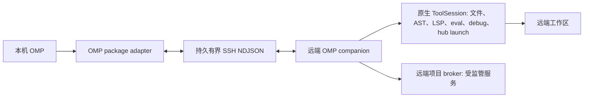

# OMP SSH Remote

简体中文 | [English](README.md)

OMP SSH Remote 将 Oh My Pi 控制面保留在本机，同时通过 SSH 在远端 Linux 主机的持久 companion 中执行有状态的 OMP 原生工作区工具。本 package 只适配 OMP；Pi Agent 使用独立的 [`../pi`](../pi/README.zh-CN.md) package。

## Runtime 边界

本机 OMP 继续负责 TUI、对话、模型凭据、session、Magic Context、`task`、`todo`、browser/computer、peer 消息以及后台任务簿记。每个 OMP session 使用一个独立远端 companion，持有远端文件系统、前台进程、hashline snapshot、AST proposal、LSP client、eval kernel、debugger session，以及该项目的受监管进程 broker。

远端原生工具：

`read`、`write`、`edit`、`bash`、`grep`、`glob`、`lsp`、`ast_grep`、`ast_edit`、受限 `eval`、`debug`，以及 `hub` 的进程监管部分。

后台执行按归属划分，而不是按工具名划分：

- `bash async:true` 创建本机 OMP 后台 job，由本机拥有 id、状态、日志、取消和 `hub jobs` 可见性；companion 在远端前台执行命令。`hub cancel`、session 退出或传输丢失都会中止远端命令。
- `hub start/ps/logs/stop/restart/describe`，以及指向进程 `name` 的 `send`/`wait`，在远端主机上的 OMP 原生 broker 中执行，服务与项目同机启动并使用远端环境。进程退出通知会像原生 launch completion 一样送达本机模型。`hub list/inbox/jobs/cancel` 与 peer `send`/`wait` 永不离开本机。
- `/remote-exit`、session 关闭或传输丢失时，companion 会停止本 session 启动的受监管进程；以 `persist` 或 `detached` 启动的进程按显式要求存活，与原生 OMP 一致。

普通非隔离子代理继承连接配置，但各自使用独立 companion。准入比较远端执行契约和原生工具 schema；hub 的本机 peer/job 参数不参与比较。`task isolated:true` 继续明确拒绝。保留宿主原生审批规则，连接返回前等待 wrapper 激活。

截断输出保存在远端 `~/.cache/omp-ssh-remote/artifacts/<namespace>`。连接到同一主机后，可用 `read` selector 或 `grep` 读取返回的 `remote-artifact://<namespace>/<id>`。companion 正常退出时删除自己的 namespace，启动时清扫超过一小时且所属 worker 已不存在的 namespace；因此 transport 丢失遗留的 artifact 会过期，但永远不会复制到本机。本机 `artifact://` 仍保持本机语义。`xd://debug` 与直接 debug 一样在远端执行。

连接时会把一组固定白名单的执行域 settings 转发给 companion，使远端工具行为与本机一致：`tools.maxTimeout`、`bash.direnv*`、`bashInterceptor.enabled/patterns`、`grep.context*`、`read.defaultLimit/renderMarkdown/summarize.*`、`images.autoResize`、`edit.fuzzyMatch/fuzzyThreshold/enforceSeenLines/blockAutoGenerated`、`lsp.formatOnWrite/diagnostics*`。取值来自宿主对本机项目的有效 settings。影响工具 schema 的 key（`async.enabled`、`edit.mode`、`eval.*`、`memory.backend`、`skillful`）和审批规则（`bash.patterns`、`bash.allowCompoundCommands`）永远不转发：schema 由编译后的 companion 固定，审批在本机评估。`worktree.clone` 在远端固定关闭，保证 `git worktree add` 作为普通 git 执行，而不是被改写成 companion 自调用。每次调用都会带上本机当前激活的工具集，使 bash interceptor 只重定向到模型实际拥有的工具。



## 环境要求

- 本机 Linux 或 WSL，OMP `>=18.0.0`，并安装 Bun `1.3+`、npm、tar、OpenSSH 和 SCP；
- 远端为 glibc Linux `x86_64` 或 `aarch64`；
- 公钥 SSH 可在 batch mode 下登录；
- 远端项目目录已存在；
- 远端需要安装项目所需的 language server 和 debug adapter，但不需要安装 Bun 或 OMP。

主机密钥使用严格校验。请通过正常的 OpenSSH `known_hosts` 信任主机，不要关闭 host checking。插件同时禁用 agent forwarding 和 SSH forwarding。

## 构建与安装

在仓库根目录执行：

```bash
bun install --frozen-lockfile
bun run build:omp
bun run build:worker:all
omp plugin link "$PWD/packages/omp"
```

package 必须包含：

```text
packages/omp/dist/extension.js
packages/omp/dist/worker-linux-x64
packages/omp/dist/worker-linux-x64.sha256
packages/omp/dist/worker-linux-arm64
packages/omp/dist/worker-linux-arm64.sha256
```

链接后重启 OMP。更新时执行 `git pull`，重新构建 extension 和 workers，再重启或 reload plugin。连接状态下 reload 会关闭该 session 的 companion，之后需要重新连接。

当前 companion 基于 OMP 18.2.3 构建。宿主升级导致工具参数变化时，需要同步固定的 OMP 构建依赖并重建两个架构的 worker；只 reload extension 不会更新远端原生执行语义。原生构建缓存按架构和版本隔离。当运行中的宿主版本与本 bundle 编译所针对的版本不同时，`/remote-status` 和首次 `session_start` 会同时报告两个版本；握手被拒绝时会指出具体工具和发生差异的 schema 属性，而不是笼统的“不兼容”。

## 连接与操作

可以使用标准 `~/.ssh/config` alias 或 OMP `/ssh add` 记录：

```text
/remote-connect gpu-box /srv/project
/remote-status
/remote-reconnect [--force]
/remote-exit
```

显式形式：

```text
/remote-connect user@example.com /srv/project --port 22 --identity ~/.ssh/id_ed25519
```

模型也可以通过 `remote_connect`、`remote_workspace_status`、`remote_reconnect` 和 `remote_exit` 执行相同生命周期。状态工具按需调用，报告进程内已知状态；它不会向每一轮注入 prompt，也不会主动 ping SSH。

连接时普通文件路径远端执行，内部 URI resource 留在本机。混合本机 URI 和远端路径的操作会被拒绝。已选择的连接失效后继续 fail-closed，直到 `/remote-reconnect` 重新建立 transport，或显式 `/remote-exit` 恢复本机执行。reconnect 复用已保存的连接参数和远端目录，保留已注册的 wrapper，丢弃死亡 companion 内的 AST proposal，且仅 owner 可执行；`--force` 会替换仍显示为已连接的 transport。断连时被停止的非持久服务不会自动重启。

## 部署与安全

adapter 探测远端平台和 home，选择 package 自带的对应 worker，校验本机 SHA-256 sidecar，用 `scp -C` 压缩上传到 UUID 临时路径，在远端复核 SHA-256 后原子启用到：

```text
~/.cache/omp-ssh-remote/omp-1/<sha256>/worker-linux-<arch>
```

启用时会修剪该 namespace 内更旧的 worker 目录，只保留刚启用的版本和最近一个旧版本，避免降级时重新上传。协议 frame 上限为 16 MiB，部署 stdout/stderr 上限为 1 MiB。SSH 使用 batch mode、严格 host checking、`ForwardAgent=no` 和 `ClearAllForwardings=yes`。transport 断开时所有 pending call 报错，不会改为本机重试。前台子进程会收到取消；显式使用 `nohup` 或 `setsid` 脱离的命令属于不受管理的远端进程，断连后可能继续运行。

## 已验证性能

2026 年 8 月在 Linux x86_64 试验主机、缓存 worker 和持久 SSH ControlMaster 条件下：

| 操作 | 结果 |
| --- | --- |
| 缓存部署探测 | `72.17 ms` |
| companion 初始化 | `1487.46 ms` |
| read p50 / p95 | `18.01 / 34.36 ms` |
| 前台 Bash p50 / p95 | `16.23 / 134.45 ms` |
| LSP status p50 / p95 | `20.05 / 38.11 ms` |

x64 worker 首次上传耗时 `32.7 s`；缓存连接不再传输 worker。数据用于验收，不代表与网络无关的性能保证。

## 限制

- 仅支持 Linux glibc x86_64 和 ARM64；
- OMP `>=18.0.0`，且 companion schema 匹配；
- 支持显式 async Bash；不桥接自动后台化和交互 Bash PTY；
- 不支持 `task isolated:true` 远端 worktree；
- 不支持远端到本机 artifact bridge；
- 白名单之外的 settings 在 companion 中保持编译默认值，不提供任意 settings 透传；
- 每个 session 或子代理各占一个 companion 进程；并发子代理各消耗一条 SSH 通道和一个 worker 进程；
- 单个输出 frame 不能超过 16 MiB；
- browser、desktop、模型凭据、memory 和本机 session 控制面不进入远端。
