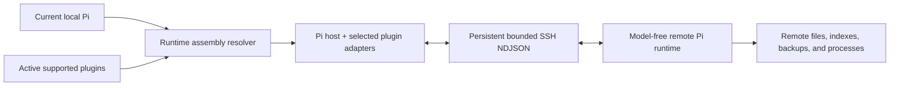

# Pi SSH Remote

[简体中文](README.zh-CN.md) | English

Pi SSH Remote keeps the Pi conversation, model credentials, UI, memory, web access, and orchestration local while executing supported workspace tools on a remote Linux host over SSH. It first adapts Pi itself, then composes explicitly supported Pi plugins into the remote runtime detected for the current session. OMP support is a separate package at [`../omp`](../omp/README.md).

## Runtime Assembly

There is no fixed `pi-aft` product profile. On each connection, the host adapter inspects the current Pi tool registry, active tool set, source provenance, and resolved package metadata. It produces a `RuntimeAssembly` containing:

- the current Pi host descriptor;
- zero or more detected plugin adapters, ordered by first appearance in the active tool registry;
- the active remote tool owner and local parameter schema for every admitted tool;
- only the companion artifacts required by those plugins;
- exact resolved local versions for diagnostics and deployment identity.

The assembly ID is derived from component contracts, tool ownership, and schemas, not from package version strings. The remote worker reports its actual Pi/plugin versions and schemas. Connection succeeds when component contracts, ownership, and every tool schema match; local and remote package version strings do not need to be equal.



This is capability-based compatibility, not unchecked compatibility. A changed Pi/plugin release is accepted only while it still satisfies the adapter contract and exact active tool schemas. Missing, duplicate, unknown, conflicting, or schema-incompatible remote tools are rejected before wrappers are registered.

## Supported Components

| Kind | ID | Current responsibility |
| --- | --- | --- |
| Host | `pi-core` | Pi-native `read`, `write`, `edit`, `bash`, `grep`, `find`, and `ls` when Pi owns them |
| Plugin adapter | `@cortexkit/aft-pi` | AFT-owned file/shell tools, background Bash lifecycle tools, AFT code tools, and the platform AFT binary |
| Local integration | `pi-subagents` | Inherit the serialized assembly and SSH connection through the process environment; the child opens an independent companion on the parent remote cwd |

With no supported plugin active, the remote runtime is pure Pi. With AFT active, AFT owns `read`, `write`, `edit`, `bash`, `grep`, `bash_status`, `bash_watch`, `bash_write`, `bash_kill`, `aft_outline`, `aft_zoom`, `aft_inspect`, `aft_conflicts`, `aft_import`, `aft_safety`, `ast_grep_search`, and `ast_grep_replace`; Pi continues to own `find` and `ls`. Other AFT tools such as `aft_search`, `lsp_diagnostics`, and `aft_callgraph` stay local until an adapter admits them.

Other installed plugins are not copied or inferred as remote-capable. Plugins that do not own an admitted workspace tool remain local. If an unsupported plugin replaces a Pi or AFT workspace tool that this adapter would otherwise remoteize, connection fails closed. Adding another remote workspace plugin requires an explicit adapter describing source detection, tool ownership, schemas, companion artifacts, and lifecycle behavior.

Model routing, credentials, memory, web access, ask/TUI, and UI extensions always remain local. Isolated `pi-subagents` worktrees are not implemented; ordinary children inherit the parent remote cwd through the process environment.

## Tool Ownership

Pi resolves duplicate extension tools first-wins and does not expose call-through to a superseded tool. Pi SSH Remote must therefore appear before any supported plugin whose tools it will shadow, including AFT.

Before connection, the local Pi/plugin runtime owns its tools. `/remote-connect` resolves the current assembly, validates the remote manifest, and registers schema-preserving wrappers. `/remote-exit` closes the companion and reloads Pi so local ownership is reconstructed. Transport or ownership failure blocks the resolved workspace surface and never falls back to the local tool accidentally.

The lifecycle acceptance path is:

```text
current local owners -> matching remote assembly owners -> restored local owners
```

## Requirements

- local Linux or WSL with a compatible current Pi Agent, Node.js, Bun `1.3+`, npm, OpenSSH, and SCP;
- a workspace plugin needs an explicit adapter to run remotely; control-plane plugins stay local;
- remote glibc Linux `x86_64` or `aarch64`;
- public-key SSH that succeeds in batch mode;
- an existing remote project directory;
- no Node.js, Bun, Pi, AFT, or model credentials are required on the remote host.

The current source build and tests resolve Pi `0.84.2` and AFT `0.51.3`; these are recorded build identities, not equality requirements in the runtime contract or Pi package peer dependencies.

Host key verification is strict. Trust the host through normal OpenSSH `known_hosts`; do not disable checking. Agent forwarding and SSH forwarding are disabled.

## Build and Install

From the repository root:

```bash
bun install --frozen-lockfile
bun run build:pi
bun run build:pi-worker:all
pi install "$PWD/packages/pi"
```

The package must contain:

```text
packages/pi/dist/pi-extension.js
packages/pi/dist/worker-linux-x64
packages/pi/dist/worker-linux-x64.sha256
packages/pi/dist/aft-linux-x64
packages/pi/dist/aft-linux-x64.sha256
packages/pi/dist/worker-linux-arm64
packages/pi/dist/worker-linux-arm64.sha256
packages/pi/dist/aft-linux-arm64
packages/pi/dist/aft-linux-arm64.sha256
```

In `~/.pi/agent/settings.json`, keep Pi SSH Remote before AFT:

```json
{
  "packages": [
    "/absolute/path/to/omp-ssh-remote/packages/pi",
    "npm:@cortexkit/aft-pi"
  ]
}
```

Other local control-plane and UI plugins may remain installed. Review ownership before placing another workspace-tool replacement ahead of Pi SSH Remote. Restart Pi or run `/reload-plugins` after installation. Reloading a connected session closes that companion; reconnect afterward.

## Connect and Operate

Use a standard `~/.ssh/config` alias:

```text
/remote-connect gpu-box /srv/project
/remote-status
/remote-exit
```

Explicit form:

```text
/remote-connect user@example.com /srv/project --port 22 --identity ~/.ssh/id_ed25519
```

The model can invoke `remote_connect`, `remote_workspace_status`, and `remote_exit`. Status reports the assembly ID, local and remote component versions, tool groups, ownership verification, and transport state. After a failed or lost connection, `/remote-exit` is required before reconnecting. `pi-subagents` children inherit the serialized assembly and SSH connection through the process environment and open independent companions on the parent remote cwd.

## Deployment and Security

The adapter deploys a content-addressed worker plus only the selected plugin artifacts. All files use SHA-256 sidecars, UUID temporary uploads, remote hash verification, and atomic activation. Workers are cached under:

```text
~/.cache/omp-ssh-remote/pi/<worker-sha256>/worker-linux-<arch>
```

When AFT is selected, its binary is cached by architecture and hash, linked beside the worker, and prepended to `PATH`. The real AFT plugin resolves that package-owned binary without network download or user cache.

The worker is model-free. Shutdown aborts active calls, waits up to five seconds, then gives plugin-owned resources up to five seconds to close. AFT background Bash is remote AFT state rather than a local orchestration job; detached processes can outlive the companion and remain the remote user's responsibility.

## Limits

- Linux glibc x86_64 and ARM64 only;
- AFT is currently the only remote plugin adapter included in the worker registry;
- new plugins require explicit adapters and a rebuilt worker artifact;
- no arbitrary third-party workspace plugin inference;
- no remote model loop, memory, web credentials, browser, or TUI;
- no isolated `pi-subagents` worktrees or general artifact bridge;
- a failed or lost connection stays fail-closed until `/remote-exit`;
- a Pi reload reconstructs plugin in-memory state;
- single protocol frames are limited to 16 MiB.
