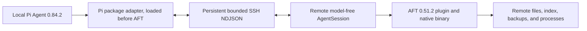

# Pi SSH Remote

[简体中文](README.zh-CN.md) | English

Pi SSH Remote keeps the Pi Agent conversation, model credentials, UI, memory, web access, and orchestration local while executing a version-locked Pi + AFT workspace profile on a remote Linux host over SSH. This package is Pi-only. OMP support is a separate package at [`../omp`](../omp/README.md).

## Runtime Boundary

The remote companion is a self-contained, model-free Pi `0.84.2` `AgentSession` loading the real `@cortexkit/aft-pi@0.51.2` extension and an adjacent platform-specific AFT binary. It does not imitate AFT's internal wire protocol.

Verified remote surface, derived from the runtime manifest:

- AFT-owned `read`, `write`, `edit`, `bash`, and `grep`;
- AFT background process tools: `bash_status`, `bash_watch`, `bash_write`, `bash_kill`;
- AFT code tools: `aft_outline`, `aft_zoom`, `aft_inspect`, `aft_conflicts`, `aft_import`, `aft_safety`, `ast_grep_search`, `ast_grep_replace`;
- Pi-native `find` and `ls`.

This is exactly 19 unique tools. The local client rejects missing, duplicate, unknown, or invalid-schema manifest entries before registering wrappers.



## Profile Ownership

Pi resolves duplicate extension tools first-wins and does not expose an OMP-style call-through to a superseded tool. Therefore this package must appear before `@cortexkit/aft-pi` in Pi settings.

Before connection, local AFT owns its tools. `remote-connect` registers schema-preserving wrappers from the verified remote manifest; because this package is earlier, those wrappers own the selected tools. `remote-exit` closes the companion and reloads Pi, reconstructing the local AFT profile. Remote ownership or transport failure is fail-closed and does not execute the local tool by accident.

A verified lifecycle test exercises:

```text
local AFT owner -> remote Pi+AFT owner -> local AFT owner
```

## Requirements

- local Linux or WSL with Pi Agent exactly `0.84.2`, Node.js, Bun `1.3+`, npm, OpenSSH, and SCP;
- local `@cortexkit/aft-pi@0.51.2` for the local profile;
- remote glibc Linux `x86_64` or `aarch64`;
- public-key SSH that succeeds in batch mode;
- an existing remote project directory;
- the remote host does not need Node.js, Bun, Pi, or AFT preinstalled.

Host key verification is strict. Trust the host through normal OpenSSH `known_hosts`; do not disable checking. Agent forwarding and SSH forwarding are disabled.

## Build and Install

From the repository root:

```bash
bun install --frozen-lockfile
bun run build:pi
bun run build:pi-worker:all
pi install "$PWD/packages/pi"
```

The package must contain:

```text
packages/pi/dist/pi-extension.js
packages/pi/dist/worker-linux-x64
packages/pi/dist/worker-linux-x64.sha256
packages/pi/dist/aft-linux-x64
packages/pi/dist/aft-linux-x64.sha256
packages/pi/dist/worker-linux-arm64
packages/pi/dist/worker-linux-arm64.sha256
packages/pi/dist/aft-linux-arm64
packages/pi/dist/aft-linux-arm64.sha256
```

In `~/.pi/agent/settings.json`, keep the package before AFT:

```json
{
  "packages": [
    "/absolute/path/to/omp-ssh-remote/packages/pi",
    "npm:@cortexkit/aft-pi"
  ]
}
```

Other local control-plane and UI plugins may remain installed. Do not add another workspace-tool replacement ahead of Pi SSH Remote without reviewing ownership and schemas.

## Connect and Operate

Use a standard `~/.ssh/config` alias:

```text
/remote-connect gpu-box /srv/project
/remote-status
/remote-exit
```

Explicit form:

```text
/remote-connect user@example.com /srv/project --port 22 --identity ~/.ssh/id_ed25519
```

The model can invoke `remote_connect`, `remote_workspace_status`, and `remote_exit`. `remote_connect` completes the SSH connection and registers wrappers without reloading Pi. `remote_exit` queues the slash command so reload occurs through Pi's command lifecycle and never uses a stale tool execution context.

`pi-subagents` child processes inherit a serialized connection specification and establish independent companion sessions. Local memory, web, ask/TUI, model, and UI plugins remain local.

## Deployment and Security

The adapter selects package-owned worker and AFT binaries for the detected architecture. Both use SHA-256 sidecars, UUID temporary uploads, remote hash verification, and atomic activation. The worker is cached under:

```text
~/.cache/omp-ssh-remote/pi/<worker-sha256>/worker-linux-<arch>
```

The AFT binary is cached by architecture and hash, then linked next to the worker. The companion prepends that directory to `PATH`, so the real AFT plugin resolves the package-owned binary without network download or user cache.

The ready manifest must report Pi `0.84.2`, runtime `0.1.0`, AFT `0.51.2`, all 19 allowlisted tools, and object parameter schemas. Transport loss blocks the known workspace surface. Shutdown aborts active calls, waits up to five seconds, then gives the AgentSession/AFT lifecycle up to five seconds to clean resources.

AFT background Bash is supported through its native `bash_status`, `bash_watch`, `bash_write`, and `bash_kill` tools. It is remote AFT state, not a local OMP `hub` job. Detached processes can outlive the companion and remain the remote user's responsibility.

## Verified Performance

Cached trial host measurements on Linux x86_64, persistent SSH ControlMaster, August 2026:

| Operation | Result |
| --- | --- |
| cached worker/AFT deployment probe | `134.54 ms` |
| headless Pi+AFT initialization | `1243.15 ms` |
| read p50 / p95 | `19.05 / 48.59 ms` |
| Bash p50 / p95 | `89.28 / 185.93 ms` |
| AFT outline p50 / p95 | `18.96 / 49.25 ms` |

The manifest contained 19 verified tools. Results are acceptance evidence, not a network-independent guarantee.

## Limits

- Linux glibc x86_64 and ARM64 only;
- Pi `0.84.2` and AFT `0.51.2` only;
- no arbitrary third-party workspace plugin inference;
- no remote model loop, memory, web credentials, browser, or TUI;
- no remote isolated worktree or artifact bridge;
- a Pi reload reconstructs plugin in-memory state;
- single protocol frames remain limited to 16 MiB.
