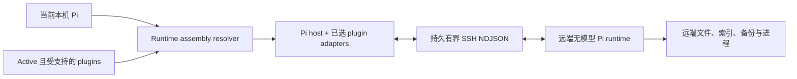

# Pi SSH Remote

简体中文 | [English](README.md)

Pi SSH Remote 将 Pi 的对话、模型凭据、UI、记忆、网络访问和任务编排保留在本机，同时通过 SSH 在远端 Linux 主机执行受支持的工作区工具。它首先适配 Pi 本身，再根据当前 session 组合已明确支持的 Pi plugin adapter。本 package 只适配 Pi；OMP 使用独立的 [`../omp`](../omp/README.zh-CN.md) package。

## Runtime Assembly

系统不再存在固定的 `pi-aft` 产品 profile。每次连接时，host adapter 都会检查当前 Pi 工具注册表、active tool set、source provenance 和已解析的 package metadata，并生成一个 `RuntimeAssembly`，其中包含：

- 当前 Pi host descriptor；
- 按当前 active tool registry 中首次出现顺序检测到的零个或多个 plugin adapter；
- 每个准入 active tool 的远端 owner 和本机参数 schema；
- 这些 plugin 实际需要的 companion artifacts；
- 用于诊断和部署身份的本机精确解析版本。

Assembly ID 由 component contract、工具所有权和 schema 计算，不包含 package version 字符串。远端 worker 会报告自己的实际 Pi/plugin 版本和 schema。只要 component contract、owner 和每个工具 schema 一致，连接就可以成功；本机与远端 package 的版本字符串不要求相等。



这是 capability-based compatibility，不是无检查兼容。新版 Pi/plugin 只有在仍满足 adapter contract 和精确 active tool schema 时才会被接纳。缺失、重复、未知、冲突或 schema 不兼容的远端工具都会在 wrapper 注册前被拒绝。

## 已支持组件

| 类型 | ID | 当前职责 |
| --- | --- | --- |
| Host | `pi-core` | 当工具由 Pi 持有时，执行 Pi 原生 `read`、`write`、`edit`、`bash`、`grep`、`find` 和 `ls` |
| Plugin adapter | `@cortexkit/aft-pi` | AFT 文件/命令工具、后台 Bash 生命周期工具、AFT 代码工具及平台 AFT binary |
| 本机 integration | `pi-subagents` | 子进程通过环境变量继承已序列化的 assembly 和 SSH 连接，并在父 session 的远端 cwd 上打开独立 companion |

没有 active 的受支持 plugin 时，远端 runtime 是纯 Pi。AFT active 时，AFT 持有 `read`、`write`、`edit`、`bash`、`grep`、`bash_status`、`bash_watch`、`bash_write`、`bash_kill`、`aft_outline`、`aft_zoom`、`aft_inspect`、`aft_conflicts`、`aft_import`、`aft_safety`、`ast_grep_search` 和 `ast_grep_replace`；Pi 继续持有 `find` 和 `ls`。AFT 的其他工具，例如 `aft_search`、`lsp_diagnostics` 和 `aft_callgraph`，在 adapter 准入前仍留在本机。

其他已安装 plugin 不会被复制，也不会被推断为可远端执行。不持有准入工作区工具的 plugin 保持本机执行。如果未支持 plugin 替换了本 adapter 原本要远端化的 Pi 或 AFT 工作区工具，连接会 fail closed。新增远端工作区 plugin 必须提供显式 adapter，描述 source detection、tool ownership、schema、companion artifacts 和 lifecycle 行为。

模型路由、凭据、memory、web access、ask/TUI 和 UI extensions 始终保持本机执行。不支持 `pi-subagents` 的隔离 worktree；普通子进程通过环境变量继承父 session 的远端 cwd。

## 工具所有权

Pi 的同名 extension tool 采用 first-wins，且没有调用被覆盖工具的公开接口。因此 Pi SSH Remote 必须排在它要 shadow 的受支持 plugin 前，包括 AFT。

未连接时，当前本机 Pi/plugin runtime 持有其工具。`/remote-connect` 解析当前 assembly、验证远端 manifest，并注册保留 schema 的 wrapper。`/remote-exit` 关闭 companion 并 reload Pi，以重建本机所有权。transport 或 ownership 失败时会阻止已解析工作区工具，不会意外 fallback 到本机工具。

生命周期验收路径为：

```text
当前本机 owners -> 匹配的远端 assembly owners -> 恢复后的本机 owners
```

## 环境要求

- 本机 Linux 或 WSL，安装兼容的当前 Pi Agent、Node.js、Bun `1.3+`、npm、OpenSSH 和 SCP；
- 工作区 plugin 必须有显式 adapter 才能在远端运行；控制面 plugin 保持本机；
- 远端为 glibc Linux `x86_64` 或 `aarch64`；
- 公钥 SSH 可在 batch mode 下登录；
- 远端项目目录已存在；
- 远端不需要预装 Node.js、Bun、Pi、AFT 或模型凭据。

当前源码构建与测试解析到 Pi `0.84.2` 和 AFT `0.51.3`；它们是本次 build identity，不是 runtime contract 或 Pi package peer dependency 的版本相等要求。

主机密钥使用严格校验。请通过正常 OpenSSH `known_hosts` 信任主机，不要关闭校验。插件同时禁用 agent forwarding 和 SSH forwarding。

## 构建与安装

在仓库根目录执行：

```bash
bun install --frozen-lockfile
bun run build:pi
bun run build:pi-worker:all
pi install "$PWD/packages/pi"
```

package 必须包含：

```text
packages/pi/dist/pi-extension.js
packages/pi/dist/worker-linux-x64
packages/pi/dist/worker-linux-x64.sha256
packages/pi/dist/aft-linux-x64
packages/pi/dist/aft-linux-x64.sha256
packages/pi/dist/worker-linux-arm64
packages/pi/dist/worker-linux-arm64.sha256
packages/pi/dist/aft-linux-arm64
packages/pi/dist/aft-linux-arm64.sha256
```

在 `~/.pi/agent/settings.json` 中，确保 Pi SSH Remote 排在 AFT 前：

```json
{
  "packages": [
    "/absolute/path/to/omp-ssh-remote/packages/pi",
    "npm:@cortexkit/aft-pi"
  ]
}
```

其他本机控制面和 UI plugin 可以继续保留。在 Pi SSH Remote 前加入其他工作区工具 replacement 前，应先审查 ownership。安装后重启 Pi 或执行 `/reload-plugins`。连接状态下 reload 会关闭该 session 的 companion，之后需要重新连接。

## 连接与操作

使用标准 `~/.ssh/config` alias：

```text
/remote-connect gpu-box /srv/project
/remote-status
/remote-exit
```

显式形式：

```text
/remote-connect user@example.com /srv/project --port 22 --identity ~/.ssh/id_ed25519
```

模型可以调用 `remote_connect`、`remote_workspace_status` 和 `remote_exit`。status 会报告 assembly ID、本机与远端 component 版本、工具分组、ownership verification 和 transport state。连接失败或丢失后，必须先 `/remote-exit` 才能重连。`pi-subagents` 子进程通过环境变量继承已序列化的 assembly 和 SSH 连接，并在父 session 的远端 cwd 上打开独立 companion。

## 部署与安全

adapter 部署按内容寻址的 worker，以及已选 plugin 实际需要的 artifacts。所有文件均使用 SHA-256 sidecar、UUID 临时上传、远端 hash 校验和原子启用。worker 缓存到：

```text
~/.cache/omp-ssh-remote/pi/<worker-sha256>/worker-linux-<arch>
```

选择 AFT 时，其 binary 会按架构和 hash 缓存、链接到 worker 旁，并加入 `PATH` 最前面。真实 AFT plugin 因而解析 package 自带 binary，不依赖网络下载或用户 cache。

worker 不运行模型。shutdown 会 abort 活跃调用并最多等待 5 秒，再给 plugin-owned resources 最多 5 秒关闭。AFT 后台 Bash 属于远端 AFT 状态，不是本机编排 job；detached process 可能在 companion 退出后继续运行，由远端用户自行管理。

## 限制

- 仅支持 Linux glibc x86_64 和 ARM64；
- AFT 是当前 worker registry 唯一包含的远端 plugin adapter；
- 新 plugin 需要显式 adapter，并重新构建 worker artifact；
- 不自动推断任意第三方工作区 plugin；
- 不在远端运行模型 loop、memory、web 凭据、browser 或 TUI；
- 不支持 `pi-subagents` 的隔离 worktree 或通用 artifact bridge；
- 连接失败或丢失后保持 fail-closed，必须先 `/remote-exit` 才能重连；
- Pi reload 会重建 plugin 内存状态；
- 单个 protocol frame 限制为 16 MiB。
