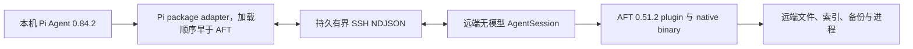

# Pi SSH Remote

简体中文 | [English](README.md)

Pi SSH Remote 将 Pi Agent 的对话、模型凭据、UI、记忆、网络访问和任务编排保留在本机，同时通过 SSH 在远端 Linux 主机运行版本锁定的 Pi + AFT 工作区 profile。本 package 只适配 Pi；OMP 使用独立的 [`../omp`](../omp/README.zh-CN.md) package。

## Runtime 边界

远端 companion 是自包含、无模型的 Pi `0.84.2` `AgentSession`，加载真实 `@cortexkit/aft-pi@0.51.2` extension 和相邻的平台专用 AFT binary。它不会仿造 AFT 内部 wire protocol。

由 runtime manifest 动态提供并完成验收的远端工具：

- AFT 接管的 `read`、`write`、`edit`、`bash` 和 `grep`；
- AFT 后台进程工具：`bash_status`、`bash_watch`、`bash_write`、`bash_kill`；
- AFT 代码工具：`aft_outline`、`aft_zoom`、`aft_inspect`、`aft_conflicts`、`aft_import`、`aft_safety`、`ast_grep_search`、`ast_grep_replace`；
- Pi 原生 `find` 和 `ls`。

合计严格为 19 个唯一工具。本机 client 在注册 wrapper 前会拒绝缺失、重复、未知或 schema 无效的 manifest 项。



## Profiles 与 Integrations

Pi host adapter 不依赖具体 profile。runtime profile 负责精确的 Pi/plugin 版本、准入工具与 schema、companion artifact bundle、工具分组和生命周期说明。共享 workspace scope 独占一个 companion 连接，并在进入 transport 前拒绝所选 profile 之外的工具。

当前支持：

| 类型               | ID             | 职责                                                                                     |
| ------------------ | -------------- | ---------------------------------------------------------------------------------------- |
| Runtime profile    | `pi-aft`       | Pi `0.84.2`、AFT `0.51.2`、严格 19 工具 manifest，以及 x64/ARM64 worker 与 AFT artifacts |
| 编排器 integration | `pi-subagents` | 将已选 profile 与连接配置传给新的 Pi 子进程，由子进程打开独立 companion scope            |

其他已安装 Pi plugin 不会被自动复制、打包或远端化。模型路由、凭据、memory、web access、ask/TUI 和 UI extensions 保持本机执行。新增工作区 plugin 需要显式版本化 profile；编排器需要独立的 scope integration。远端 workflow worktree 尚未实现。

## Profile 所有权

Pi 的同名 extension tool 采用 first-wins，且没有 OMP 那种调用被覆盖工具的公开接口。因此本 package 必须在 Pi settings 中排在 `@cortexkit/aft-pi` 前面。

未连接时本机 AFT 持有工具。`remote-connect` 根据已验证远端 manifest 注册保留真实 schema 的 wrapper；由于本 package 加载更早，wrapper 会取得所选工具所有权。`remote-exit` 关闭 companion 并 reload Pi，重建本机 AFT profile。远端所有权或 transport 失败时采用 fail-closed，不会误执行本机工具。

永久生命周期验收覆盖：

```text
本机 AFT owner -> 远端 Pi+AFT owner -> 本机 AFT owner
```

## 环境要求

- 本机 Linux 或 WSL，Pi Agent 必须为 `0.84.2`，并安装 Node.js、Bun `1.3+`、npm、OpenSSH 和 SCP；
- 本机安装 `@cortexkit/aft-pi@0.51.2`，用于本机 profile；
- 远端为 glibc Linux `x86_64` 或 `aarch64`；
- 公钥 SSH 可在 batch mode 下登录；
- 远端项目目录已存在；
- 远端不需要预装 Node.js、Bun、Pi 或 AFT。

主机密钥使用严格校验。请通过正常 OpenSSH `known_hosts` 信任主机，不要关闭校验。插件同时禁用 agent forwarding 和 SSH forwarding。

## 构建与安装

在仓库根目录执行：

```bash
bun install --frozen-lockfile
bun run build:pi
bun run build:pi-worker:all
pi install "$PWD/packages/pi"
```

package 必须包含：

```text
packages/pi/dist/pi-extension.js
packages/pi/dist/worker-linux-x64
packages/pi/dist/worker-linux-x64.sha256
packages/pi/dist/aft-linux-x64
packages/pi/dist/aft-linux-x64.sha256
packages/pi/dist/worker-linux-arm64
packages/pi/dist/worker-linux-arm64.sha256
packages/pi/dist/aft-linux-arm64
packages/pi/dist/aft-linux-arm64.sha256
```

在 `~/.pi/agent/settings.json` 中，确保本 package 排在 AFT 前：

```json
{
  "packages": [
    "/absolute/path/to/omp-ssh-remote/packages/pi",
    "npm:@cortexkit/aft-pi"
  ]
}
```

其他本机控制面和 UI plugin 可以继续保留。未经 tool owner 与 schema 审查，不要在 Pi SSH Remote 前再加入另一个替换工作区工具的 plugin。

## 连接与操作

使用标准 `~/.ssh/config` alias：

```text
/remote-connect gpu-box /srv/project
/remote-status
/remote-exit
```

显式形式：

```text
/remote-connect user@example.com /srv/project --port 22 --identity ~/.ssh/id_ed25519
```

模型可以调用 `remote_connect`、`remote_workspace_status` 和 `remote_exit`。`remote_connect` 完成 SSH 连接并在不 reload Pi 的情况下注册 wrapper。`remote_exit` 将斜杠命令排入 Pi command 生命周期中执行 reload，不会从 tool execution context 使用 stale context。

`pi-subagents` 子进程继承序列化连接配置，并建立独立 companion session。本机 memory、web、ask/TUI、模型和 UI plugin 继续在本机执行。

## 部署与安全

adapter 根据探测到的架构选择 Pi package 自带的 worker 和 AFT binary。二者均使用 SHA-256 sidecar、UUID 临时上传、远端 hash 校验和原子启用。worker 缓存到：

```text
~/.cache/omp-ssh-remote/pi/<worker-sha256>/worker-linux-<arch>
```

AFT binary 按架构和 hash 缓存，再链接到 worker 旁边。companion 将该目录加入 `PATH` 最前面，因此真实 AFT plugin 会解析 package 自带 binary，不依赖网络下载或用户 cache。

ready manifest 必须报告 Pi `0.84.2`、runtime `0.1.0`、AFT `0.51.2`、全部 19 个 allowlist 工具和对象参数 schema。transport 断开时阻止已知工作区工具。shutdown 会 abort 活跃调用并最多等待 5 秒，再给 AgentSession/AFT 生命周期最多 5 秒清理资源。

AFT 后台 Bash 通过原生 `bash_status`、`bash_watch`、`bash_write` 和 `bash_kill` 支持。它属于远端 AFT 状态，不是本机 OMP `hub` job。脱离 companion 的 detached process 可能继续运行，由远端用户自行管理。

## 已验证性能

2026 年 8 月在 Linux x86_64 试验主机、缓存 worker/AFT 和持久 SSH ControlMaster 条件下：

| 操作                     | 结果                |
| ------------------------ | ------------------- |
| 缓存 worker/AFT 部署探测 | `134.54 ms`         |
| headless Pi+AFT 初始化   | `1243.15 ms`        |
| read p50 / p95           | `19.05 / 48.59 ms`  |
| Bash p50 / p95           | `89.28 / 185.93 ms` |
| AFT outline p50 / p95    | `18.96 / 49.25 ms`  |

manifest 包含 19 个已验证工具。数据用于验收，不代表与网络无关的性能保证。

## 限制

- 仅支持 Linux glibc x86_64 和 ARM64；
- 仅支持 Pi `0.84.2` 和 AFT `0.51.2`；
- 不自动推断任意第三方工作区 plugin；
- 不在远端运行模型 loop、memory、web 凭据、browser 或 TUI；
- 不支持远端 isolated worktree 或 artifact bridge；
- Pi reload 会重建 plugin 内存状态；
- 单个 protocol frame 仍限制为 16 MiB。
